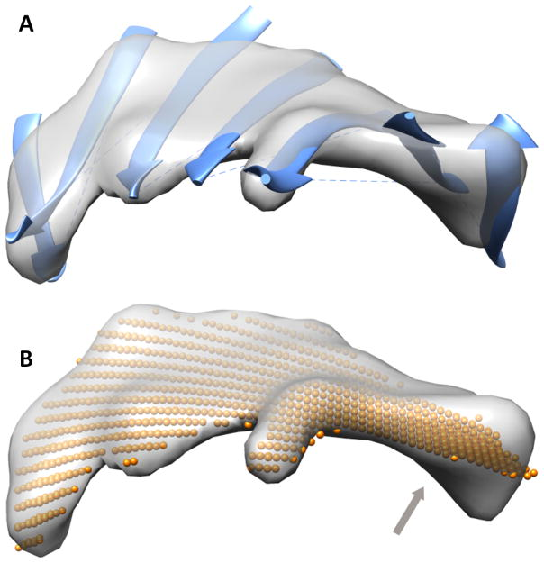
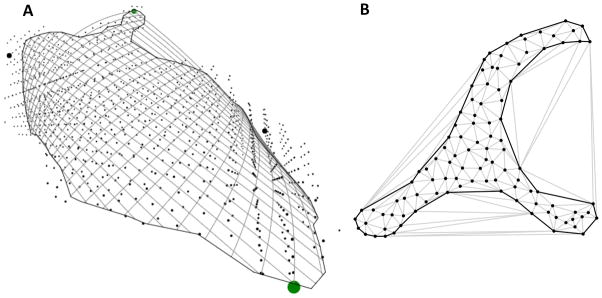
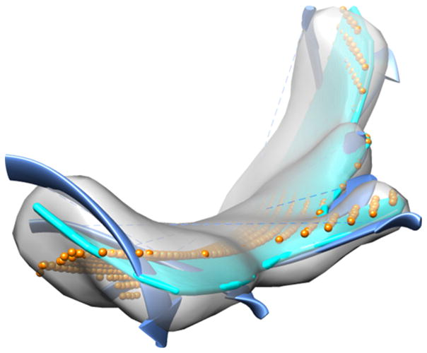
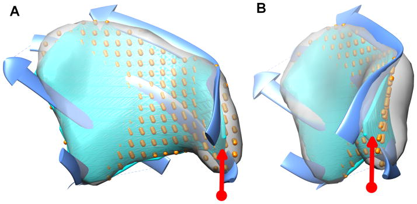

<section class="paper-abstract">
<h2>Abstract</h2>

Cryo-electron microscopy (Cryo-EM) is a powerful technique to produce 3-dimensional density maps for large molecular complexes. Although many atomic structures have been solved from cryo-EM density maps, it is challenging to derive atomic structures when the resolution of density maps is not sufficiently high. Geometrical shape representation of secondary structural components in a medium-resolution density map enhances modeling of atomic structures. We compare two methods in producing surface representation of the β-sheet component of a density map. Given a 3-dimensional volume of β-sheet that is segmented from a density map, the performance of a polynomial fitting was compared with that of an iterative Bézier fitting. The results suggest that the iterative Bézier fitting is more suitable for β-sheets, since it provides more accurate representation of the corners that are naturally twisted in a β-sheet.

</section>

<section id="S1"><h2>1. INTRODUCTION</h2>

Cryo-electron microscopy (cryo-EM) is a biophysical technique to produce electron density maps of large molecular assemblies(<a href="#R12">Chiu et al., 2005</a>; <a href="#R18">Hryc et al., 2011</a>; <a href="#R31">Zhang et al., 2010</a>; <a href="#R33">Zhou, 2008</a>; <a href="#R34">Zhou et al., 2000</a>). A density map is a 3-dimensional image in which each voxel is associated with a density value that represents the local density of electrons. Many molecular complexes, such as ribosomes and viruses, have been resolved to atomic resolutions using this technique (<a href="#R7">Anger et al., 2013</a>; <a href="#R20">Jiang et al., 2008</a>; <a href="#R32">Zhang et al., 2013</a>). At high resolutions about 3Å, details of amino acids are resolved, and atomic structures can be derived. However, it is challenging to obtain high-resolution 3D images for many biological specimen due to the nature of biological samples. At medium resolutions, such as 5–10Å, amino acid details are not resolved, and it is often not possible to distinguish the chain of a protein in the image. What is possible to be distinguished from medium-resolution images includes rough location of secondary structures, such as α-helices, β-sheets, (<a href="#R8">Baker et al., 2007</a>; <a href="#R14">Dal Palu et al., 2006</a>; <a href="#R19">Jiang et al., 2001</a>; <a href="#R22">Kong and Ma, 2003</a>; <a href="#R26">Rusu and Wriggers, 2012</a>; <a href="#R27">Si and He, 2013</a>; <a href="#R29">Si et al., 2012</a>; <a href="#R30">Zeyun and Bajaj, 2008</a>) and possible connections among secondary structures (<a href="#R4">Al Nasr et al., 2013</a>; <a href="#R21">Ju et al., 2007</a>). An α-helix appears as a cylinder and a β-sheet appears as a thin layer of density image at medium resolutions. Various computational methods have been developed to segment secondary structures from cryo-EM images, such as <em>Helixhunter</em>, <em>SSEhunter</em>, <em>HelixTracer</em>, <em>SSELearner Voltrac</em>, and <em>SSETracer</em>. (<a href="#R8">Baker et al., 2007</a>; <a href="#R14">Dal Palu et al., 2006</a>; <a href="#R19">Jiang et al., 2001</a>; <a href="#R26">Rusu and Wriggers, 2012</a>; <a href="#R27">Si and He, 2013</a>; <a href="#R29">Si et al., 2012</a>). In addition to secondary structure detection, it is possible to match secondary structures detected from the cryo-EM density map to those predicted from protein amino acid sequence, in order to derive the backbone trace of the protein(<a href="#R1">Abeysinghe et al., 2008</a>; <a href="#R2">Al Nasr and He, 2016</a>; <a href="#R3">Al Nasr et al., 2011</a>; <a href="#R5">Al Nasr et al., 2014</a>; <a href="#R6">Al Nasr et al., 2012</a>; <a href="#R9">Baker et al., 2011</a>; <a href="#R10">Biswas et al., 2015</a>; <a href="#R11">Biswas et al., 2016</a>; <a href="#R23">Lindert et al., 2012</a>).

A β-sheet is composed of multiple β-strands. <a href="#F1">Figure 1</a> shows an example of a 7-stranded β-sheet. Knowing the position of a β-sheet without knowing the position of β-strands is often not sufficient to model the 3-dimensional structure of a protein, since each β-strand, not a β-sheet, corresponds to a segment of the protein sequence. The spacing between two neighboring β-strands is 4.5Å–5Å, too small to be resolved in an image with 5–10Å resolution. In spite of the difficulty in distinguishing individual β-strands from a medium-resolution map, we previously showed that it is possible to predict the position of the β-strands of a β-sheet through the analysis of β-sheet twist (<a href="#R28">Si and He, 2014</a>). A unique nature of a β-sheet is that each one is right-handed twisted (<a href="#R13">Chothia, 1973</a>). <em>StrandTwister</em> utilizes this special character of a β-sheet to model the orientation of β-strands (<a href="#R28">Si and He, 2014</a>).

<figure class="paper-fig" id="F1"><h3 class="obj_head">Figure 1.</h3>

<figcaption>
β-sheet, β-strands and β-sheet image. A β-sheet is composed of multiple β-strands, each shown as a ribbon in (A). An image (gray) of a β-sheet is superimposed with its atomic structure of β-sheet (ribbons) in (A) and a polynomial surface (golden dots) in (B). An example of the region where the surface does not fit well the image is marked with an arrow.
</figcaption></figure>
Given an atomic structure of a protein, a twist angle can be calculated along the peptide orientation and has been shown to have right-handed twist on a β-strand (<a href="#R13">Chothia, 1973</a>). For a given atomic model of a β-sheet, the twist angle is often less than 40° (<a href="#R17">Ho and Curmi, 2002</a>; <a href="#R25">Richardson, 1981</a>). However, when precise location of atoms is not available, as for a β-sheet image, precise calculation of a twist angle is challenging. We measured a twist angle that is represented by two neighboring β-traces, each of which is a central line of the β-strand (<a href="#R28">Si and He, 2014</a>). In such a case, accurate calculation of twist angles depends on accurate modeling of a β-sheet.

Since the density image of a β-sheet appears as a thin layer, two previous methods exist to represent a β-sheet from its 3D image. Thinning and pruning is an image processing technique, and has been used to produce a thin surface from a 3D image at the β-sheet region (<a href="#R21">Ju et al., 2007</a>). This method is an effective way to detect a β-sheet, but the resulting surface is not smooth enough for direct calculation of twist angles. A polynomial fitting method was used in <em>StrandTwister</em> (<a href="#R27">Si and He, 2013</a>; <a href="#R28">Si and He, 2014</a>). The polynomial was selected using least square fitting of the voxels in the β-sheet image. Although the surface appears to fit well in most part of the image, it does not fit accurately for a large β-sheet, particularly at the corner regions (arrow in <a href="#F1">Figure 1</a>). It is possible that a polynomial is not a sufficient model to represent a twisted surface.

In this paper, we explore a general mathematical model to represent the surface of any given β-sheet, large or small. We propose to use an iterative Bézier surface to fit a β-sheet image. We show that the proposed model improves fitting accuracy, particularly for the corners of a β-sheet.
</section><section id="S2"><h2>2. METHOD</h2>

The surface model is derived iteratively using a Bézier model. At each iteration, a set of control points are identified and used to guide the surface model. The overall process includes four major steps: (1) initial plane fitting; (2) generating initial bounding box of the β-sheet image; (3) iterative fitting of Bézier surfaces; (4) definition of a polygonal boundary of the surface.

<section id="S3"><h3>2.1 Pre-processing</h3>

Before iterative fitting of Bézier surfaces, initial control points need to be identified and the initial boundary of the image need to be outlined. Since a β-sheet is a thin layer of density, a simple geometrical representation of a β-sheet is a plane. We utilized a plane to assist the initialization of the boundary and control points. To search for the best-fit plane of the β-sheet image, we define the plane in (<a href="#FD1">1</a>) and (<a href="#FD2">2</a>) and search for the best fit plane using (<a href="#FD3">3</a>).

<table class="disp-formula" id="FD1"><tr>
<td class="formula"><math display="block" id="M1" overflow="linebreak"><mrow><mtable columnalign="left"><mtr><mtd><mi>A</mi><mo>=</mo><mo>sin</mo><mi mathvariant="normal">α</mi><mo>cos</mo><mi mathvariant="normal">β</mi></mtd></mtr><mtr><mtd><mi>B</mi><mo>=</mo><mo>sin</mo><mi mathvariant="normal">α</mi><mo>sin</mo><mi mathvariant="normal">β</mi></mtd></mtr><mtr><mtd><mi>C</mi><mo>=</mo><mo>cos</mo><mi mathvariant="normal">α</mi></mtd></mtr><mtr><mtd><mi>D</mi><mo>=</mo><mi mathvariant="normal">Δ</mi></mtd></mtr></mtable></mrow></math></td>
<td class="label">(1)</td>
</tr></table>
<table class="disp-formula" id="FD2"><tr>
<td class="formula"><math display="block" id="M2" overflow="linebreak"><mrow><mi>A</mi><mi>x</mi><mo>+</mo><mi>B</mi><mi>y</mi><mo>+</mo><mi>C</mi><mi>z</mi><mo>+</mo><mi>D</mi><mo>=</mo><mn>0</mn></mrow></math></td>
<td class="label">(2)</td>
</tr></table>

Where <em>p</em> = (<em>x</em>, <em>y</em>, <em>z</em>) is a point in 3-dimensional space, α and β are angle variables between 0 and 2π. Δ is a real number. <em>P</em> is the set of all points in the β-sheet image.

<table class="disp-formula" id="FD3"><tr>
<td class="formula"><math display="block" id="M3" overflow="linebreak"><mrow><munder><mo>min</mo><mrow><mi mathvariant="normal">α</mi><mo>,</mo><mi mathvariant="normal">β</mi><mo>,</mo><mi mathvariant="normal">Δ</mi></mrow></munder><msub><mi mathvariant="normal">∑</mi><mrow><mi>p</mi><mo>∈</mo><mi>P</mi></mrow></msub><msup><mrow><mo stretchy="false">(</mo><mi>A</mi><mi>x</mi><mo>+</mo><mi>B</mi><mi>y</mi><mo>+</mo><mi>C</mi><mi>z</mi><mo>+</mo><mi>D</mi><mo stretchy="false">)</mo></mrow><mn>2</mn></msup></mrow></math></td>
<td class="label">(3)</td>
</tr></table>

In principle a least square fitting of a plane will determine the best-fit plane of the β-sheet image, but we implemented an approach simply varying α, β, and Δ based on the feedback of the fitting error in (<a href="#FD3">3</a>). It appears to work in all test cases. The accuracy of the initial plane is not critical. The optimization stops when a desired threshold of error is reached.

Once a plane was found, the initial boundary and control points were defined by projecting the β-sheet image to the plane to create a 2-dimensional image. A rectangle was identified on the 2-dimensional image using Deming regression (<a href="#R15">Deming, 1980</a>), a heuristic method to approximate a bounding box. This heuristic method is in <em>O</em>(<em>n</em>) where <em>n</em> is the number of points to be bounded. Once the bounding box is defined, the four corner points are projected back to the β-sheet image to define the initial four control points in 3-dimensional space.
</section><section id="S4"><h3>2.2 Iterative Bézier Surface Fitting</h3>

Bézier surface is a parametric surface <em>S</em> defined as in (<a href="#FD4">4</a>).

<table class="disp-formula" id="FD4"><tr>
<td class="formula"><math display="block" id="M4" overflow="linebreak"><mrow><mi>S</mi><mo stretchy="false">(</mo><mi>u</mi><mo>,</mo><mi>v</mi><mo stretchy="false">)</mo><mo>=</mo><munderover><mo>∑</mo><mrow><mi>i</mi><mo>=</mo><mn>0</mn></mrow><mi>n</mi></munderover><mrow><munderover><mo>∑</mo><mrow><mi>j</mi><mo>=</mo><mn>0</mn></mrow><mi>m</mi></munderover><mrow><msubsup><mi>B</mi><mi>i</mi><mi>n</mi></msubsup><mo stretchy="false">(</mo><mi>u</mi><mo stretchy="false">)</mo><mspace width="0.38889em"></mspace><msubsup><mi>B</mi><mi>j</mi><mi>m</mi></msubsup><mo stretchy="false">(</mo><mi>v</mi><mo stretchy="false">)</mo><mspace width="0.38889em"></mspace><msub><mi mathvariant="bold">C</mi><mrow><mi>i</mi><mo>,</mo><mi>j</mi></mrow></msub></mrow></mrow></mrow></math></td>
<td class="label">(4)</td>
</tr></table>

In which <strong>C</strong><em>i,j</em> is a control point in 3-dimensional space, <em>i</em> = 0, .., <em>n;j</em> = 0, …, <em>m</em>. A control point is the position of a selected voxel of the β-sheet image through a pre-processing step. 
<math display="inline" id="M5" overflow="linebreak"><mrow><msubsup><mi>B</mi><mi>i</mi><mi>n</mi></msubsup><mo stretchy="false">(</mo><mi>u</mi><mo stretchy="false">)</mo></mrow></math> is defined as in (<a href="#FD5">5</a>).

<table class="disp-formula" id="FD5"><tr>
<td class="formula"><math display="block" id="M6" overflow="linebreak"><mrow><msubsup><mi>B</mi><mi>i</mi><mi>n</mi></msubsup><mo stretchy="false">(</mo><mi>u</mi><mo stretchy="false">)</mo><mo>=</mo><mrow><mo>(</mo><mtable><mtr><mtd><mi>n</mi></mtd></mtr><mtr><mtd><mi>i</mi></mtd></mtr></mtable><mo>)</mo></mrow><mspace width="0.38889em"></mspace><msup><mi>u</mi><mi>i</mi></msup><msup><mrow><mo stretchy="false">(</mo><mn>1</mn><mo>-</mo><mi>u</mi><mo stretchy="false">)</mo></mrow><mrow><mi>n</mi><mo>-</mo><mi>i</mi></mrow></msup></mrow></math></td>
<td class="label">(5)</td>
</tr></table>

Using the initial four control points derived in the pre-processing step, an initial surface is decided by searching for a Bézier surface that generates the smallest fitting error evaluated as Least Squared Orthogonal Projection distance in (<a href="#FD6">6</a>).

<table class="disp-formula" id="FD6"><tr>
<td class="formula"><math display="block" id="M7" overflow="linebreak"><mrow><mtext>RMSE</mtext><mo stretchy="false">(</mo><mi>P</mi><mo>,</mo><mi>S</mi><mo stretchy="false">)</mo><mo>=</mo><msqrt><mrow><mfrac><mn>1</mn><mrow><mo>∣</mo><mi>P</mi><mo>∣</mo></mrow></mfrac><msub><mo>∑</mo><mrow><mi>p</mi><mo>∈</mo><mi>P</mi></mrow></msub><msup><mrow><mo stretchy="false">(</mo><mi>d</mi><mo stretchy="false">(</mo><mi>p</mi><mo>,</mo><mover accent="true"><mi>p</mi><mo>¯</mo></mover><mo stretchy="false">)</mo><mo stretchy="false">)</mo></mrow><mn>2</mn></msup></mrow></msqrt></mrow></math></td>
<td class="label">(6)</td>
</tr></table>

<em>p</em> is a point on the β-sheet image, and <em>p̄</em> is a point on surface <em>S</em> with the shortest distance from <em>p. d</em>(<em>p</em>, <em>p̄</em>) is the distance between point <em>p</em> and <em>p̄</em>. For a general surface, calculating point projection onto a surface is a non-trivial optimization problem. We approximate the closest point using a fast local optimization. Initially a set of points were uniformly distributed on the surface. Given a voxel in the β-sheet image, its closest point on the surface is searched in the local neighborhood of an initial point using gradient descent method. To search for the surface with the minimal orthogonal distance, the position of control points were searched in a local neighborhood.

The iterative step of fitting Bézier surfaces consists of adding more control points and regenerating approximately best-fit surfaces. The number of control points changed from 2×2 to 3×3 and 4×4, as examples. The number of control points <em>nm</em> is chosen to balance between precision and performance. <a href="#F2">Figure 2A</a> was generated with <em>n</em> = <strong>6</strong> and <em>m</em> = <strong>10</strong>. Because each point projection takes a constant amount of time, our heuristic allows us to compute RMSE of orthogonal in <em>O</em>(<em>n</em>) time.

<figure class="paper-fig" id="F2"><h4 class="obj_head">Figure 2.</h4>

<figcaption>
Polygonal boundary and Delaunay triangulation. A: An example of the polygonal boundary (thick lines) of the surface for protein 1CHD (PDB ID) β-sheet 1. Larger dots are control points of Bézier surface; fine dots are voxels of the β-sheet image. B: An example of the long edges that are pruned after Delaunay triangulation (gray lines) using χ algorithm (<a href="#R16">Duckham et al., 2008</a>). Dark lines are the resulting boundary of the point set.
</figcaption></figure></section><section id="S5"><h3>2.3 Polygonal Boundary of the β-sheet Surface</h3>

A Bézier surface is traditionally defined as a patch, with surface variables <em>u</em> and <em>v</em> ranging from 0 to 1. However, a β-sheet will not have the shape of a square patch. Thus, a way to outline the β-sheet region on the Bézier surface is needed. We first projected the voxels of the β-sheet image onto the optimized Bézier surface. We then calculated the Delaunay triangulation of the point set using the code provided at <a href="https://github.com/ironwallaby/delaunay">https://github.com/ironwallaby/delaunay</a>.

After the triangles are generated using Delaunay, long edges at the boundary are iteratively pruned using χ algorithm until a desired maximum edge length is reached (<a href="#R16">Duckham et al., 2008</a>) (<a href="#F2">Figure 2</a>). A polygonal boundary is generated this way on the Bézier surface to outline the boundary of the β-sheet. Note that the Delaunay triangulation and the pruning using χ algorithm has <em>O</em>(<em>nlgn</em>) time, since the algorithm uses a relational map to represent and access the triangulation efficiently. An example of the surface boundary derived for a β-sheet of protein 1CHD (PDB ID) is shown in <a href="#F2">Figure 2</a>.
</section><section id="S6"><h3>2.4 Polynomial Fitting of a β-sheet Image</h3>

Previous studies have shown that an order 3 polynomial can be an approximation of a beta-sheet. We summarize the polynomial fitting here. More details can be found in (<a href="#R27">Si and He, 2013</a>; <a href="#R28">Si and He, 2014</a>). Given an isolated 3D image of a beta-sheet, it was first aligned with the Z-axis of the coordinate system using the normal vector that passes through the center of the image. Least square fitting of the image using (<a href="#FD7">7</a>) was performed to determine parameters A to J. Finally, the beta-sheet image and the polynomial surface were rotated back to the original position.

<table class="disp-formula" id="FD7"><tr>
<td class="formula"><math display="block" id="M8" overflow="linebreak"><mrow><mi>z</mi><mo>=</mo><mi>A</mi><msup><mi>x</mi><mn>3</mn></msup><mo>+</mo><mi>B</mi><msup><mi>y</mi><mn>3</mn></msup><mo>+</mo><mi>C</mi><msup><mi>x</mi><mn>2</mn></msup><mo>+</mo><mi>D</mi><msup><mi>y</mi><mn>2</mn></msup><mo>+</mo><mi>E</mi><msup><mi>x</mi><mn>2</mn></msup><mi>y</mi><mo>+</mo><mi>F</mi><msup><mi>y</mi><mn>2</mn></msup><mi>x</mi><mo>+</mo><mi mathvariant="italic">Gxy</mi><mo>+</mo><mi>H</mi><mi>x</mi><mo>+</mo><mi>I</mi><mi>y</mi><mo>+</mo><mi>J</mi></mrow></math></td>
<td class="label">(7)</td>
</tr></table>

Fitting error was estimated using the RMSE between the image and the surface in (<a href="#FD8">8</a>).

<table class="disp-formula" id="FD8"><tr>
<td class="formula"><math display="block" id="M9" overflow="linebreak"><mrow><mi mathvariant="italic">RMSE</mi><mspace width="0.16667em"></mspace><mo stretchy="false">(</mo><mi>P</mi><mo>,</mo><mi>S</mi><mo stretchy="false">)</mo><mo>=</mo><msqrt><mrow><mstyle scriptlevel="1"><mfrac><mn>1</mn><mrow><mo>∣</mo><mi>P</mi><mo>∣</mo></mrow></mfrac></mstyle><msub><mo>∑</mo><mrow><mi>p</mi><mo>∈</mo><mi>P</mi></mrow></msub><msup><mrow><mo stretchy="false">(</mo><msub><mi>z</mi><mi>i</mi></msub><mo>-</mo><msub><mover accent="true"><mi>z</mi><mo>¯</mo></mover><mi>i</mi></msub><mo stretchy="false">)</mo></mrow><mn>2</mn></msup></mrow></msqrt></mrow></math></td>
<td class="label">(8)</td>
</tr></table>

Where <em>zi</em> is the Z coordinate of <em>i</em>-th voxel of the β-sheet image <em>P</em>, and <em>z̄i</em> is the Z coordinate of its corresponding point on surface <em>S</em>. Note that the image and the surface are registered using the normal vector of image <em>P</em> and the Z-axis of surface <em>S</em>.
</section></section><section id="S7"><h2>3. RESULTS</h2>

Iterative Bézier surface fitting was tested using two sets of β-sheet images. The first set contains eight simulated β-sheet images (see 3.1) and the second contains five β-sheet images extracted from cryo-EM density map EMD1237 (see 3.2). We compared two surface fitting methods – the polynomial fitting and the iterative Bézier fitting. In evaluation of the performance, we compared the root-mean-square-error (RMSE) between the β-sheet image and the surface model. Since the polynomial fitting was implemented in <em>StrandTwister</em>, the RMSE calculation in <em>StrandTwister</em>, as in (<a href="#FD8">8</a>), was directly used in comparison. The RMSE between the β-sheet image and the Bézier surface was calculated after each voxel in the image is registered with its closest point on the surface model. We also performed visual inspection by superposition of the atomic structure, the image, and the surface model of the β-sheet.

<section id="S8"><h3>3.1 Fitting Simulated β-sheet Images</h3>

For each of the eight simulated test cases, the atomic structure of a β-sheet was used to simulate the β-sheet image. The atomic structures were downloaded from the Protein Data Bank, and all atoms on a β-sheet were used to simulate the 3-dimensional image of the β-sheet to 10 Å resolution using <em>molmap</em> function in Chimera (<a href="#R24">Pettersen et al., 2004</a>). To guide the surface fitting to-wards the dense points of the image, a density threshold was used to generate the β-sheet image. The same threshold was used in each test case for both the polynomial and Bézier fitting. An example of the simulated β-sheet image (gray region in <a href="#F4">Figure 4</a>) is superimposed with the atomic structure (ribbon in <a href="#F4">Figure 4</a>). Although most of the polynomial surface (golden dots) is fairly close to the Bézier surface (blue), differences are seen mostly at the corner or the edge of the image (<a href="#F4">Figure 4</a>). Bézier surface appears to be closer to the atomic structure (ribbon) at the corner in this case than the polynomial surface.

<figure class="paper-fig" id="F4"><h4 class="obj_head">Figure 4.</h4>

<figcaption>
Bézier surface and the polynomial surface for β-sheet 1 of protein 1CHD (PDB ID). Figure 4 and <a href="#F3">Figure 3</a> use the same color annotation.
</figcaption></figure>
Each of the eight β-sheets contains three to ten β-strands. We observed that the RMSE error between the image and the Bézier surface (column 3 of <a href="#T1">Table 1</a>) is consistently smaller than that for the polynomial surface (column 4 of <a href="#T1">Table 1</a>). As an example, β-sheet 1A12_A has four strands. The RMSE between the image and Bézier surface is 1.01Å (<a href="#T1">Table 1</a>). The RMSE between the β-sheet image and the polynomial surface is 1.15Å. The major difference in fitting appears to be located at the corner region (<a href="#F3">Figure 3</a>). Bézier surface represents more accurately at the corner of a β-sheet, and that is expected since the shape of the corners will be mostly amplified by the twist of a β-sheet. Our test suggests that the iteratively fitted Bézier surface is more accurate than the polynomial surface. Although this case involves a β-sheet of only four strands, one of the β-strands has a significant kink, as seen for some β-sheets. It is possible that a polynomial is not the best way to fit such a case. We noticed that a Bézier surface is more flexible to represent a twisted shape.

<section class="paper-table" id="T1"><h4 class="obj_head">Table 1.</h4>

Comparison of surface fitting error.

<table frame="hsides" rules="groups">
<thead><tr>
<th align="left" colspan="1" rowspan="1" valign="bottom">PDB ID<a href="#TFN1">a</a>
</th>
<th align="center" colspan="1" rowspan="1" valign="bottom">#Strd<a href="#TFN2">b</a>
</th>
<th align="center" colspan="1" rowspan="1" valign="bottom">BzFit<a href="#TFN3">c</a>
</th>
<th align="center" colspan="1" rowspan="1" valign="bottom">PolyFit<a href="#TFN4">d</a>
</th>
<th align="center" colspan="1" rowspan="1" valign="bottom">Thrsh<a href="#TFN5">e</a>
</th>
<th align="center" colspan="1" rowspan="1" valign="bottom">#Voxels<a href="#TFN6">f</a>
</th>
</tr></thead>
<tbody>
<tr>
<td align="left" colspan="1" rowspan="1" valign="top">1IG0_B</td>
<td align="center" colspan="1" rowspan="1" valign="top">10</td>
<td align="center" colspan="1" rowspan="1" valign="top">1.19</td>
<td align="center" colspan="1" rowspan="1" valign="top">2.00</td>
<td align="center" colspan="1" rowspan="1" valign="top">0.33</td>
<td align="center" colspan="1" rowspan="1" valign="top">1868</td>
</tr>
<tr>
<td align="left" colspan="1" rowspan="1" valign="top">1QNA_C</td>
<td align="center" colspan="1" rowspan="1" valign="top">9</td>
<td align="center" colspan="1" rowspan="1" valign="top">1.07</td>
<td align="center" colspan="1" rowspan="1" valign="top">1.45</td>
<td align="center" colspan="1" rowspan="1" valign="top">0.33</td>
<td align="center" colspan="1" rowspan="1" valign="top">1764</td>
</tr>
<tr>
<td align="left" colspan="1" rowspan="1" valign="top">1DTD_A</td>
<td align="center" colspan="1" rowspan="1" valign="top">8</td>
<td align="center" colspan="1" rowspan="1" valign="top">1.64</td>
<td align="center" colspan="1" rowspan="1" valign="top">2.13</td>
<td align="center" colspan="1" rowspan="1" valign="top">0.29</td>
<td align="center" colspan="1" rowspan="1" valign="top">2621</td>
</tr>
<tr>
<td align="left" colspan="1" rowspan="1" valign="top">1CHD_SH1</td>
<td align="center" colspan="1" rowspan="1" valign="top">7</td>
<td align="center" colspan="1" rowspan="1" valign="top">0.99</td>
<td align="center" colspan="1" rowspan="1" valign="top">1.53</td>
<td align="center" colspan="1" rowspan="1" valign="top">0.33</td>
<td align="center" colspan="1" rowspan="1" valign="top">1106</td>
</tr>
<tr>
<td align="left" colspan="1" rowspan="1" valign="top">1ATZ_A</td>
<td align="center" colspan="1" rowspan="1" valign="top">6</td>
<td align="center" colspan="1" rowspan="1" valign="top">0.99</td>
<td align="center" colspan="1" rowspan="1" valign="top">1.21</td>
<td align="center" colspan="1" rowspan="1" valign="top">0.35</td>
<td align="center" colspan="1" rowspan="1" valign="top">1117</td>
</tr>
<tr>
<td align="left" colspan="1" rowspan="1" valign="top">1AKY_A</td>
<td align="center" colspan="1" rowspan="1" valign="top">5</td>
<td align="center" colspan="1" rowspan="1" valign="top">1.37</td>
<td align="center" colspan="1" rowspan="1" valign="top">1.49</td>
<td align="center" colspan="1" rowspan="1" valign="top">0.29</td>
<td align="center" colspan="1" rowspan="1" valign="top">1102</td>
</tr>
<tr>
<td align="left" colspan="1" rowspan="1" valign="top">1A12_A</td>
<td align="center" colspan="1" rowspan="1" valign="top">4</td>
<td align="center" colspan="1" rowspan="1" valign="top">1.01</td>
<td align="center" colspan="1" rowspan="1" valign="top">1.15</td>
<td align="center" colspan="1" rowspan="1" valign="top">0.34</td>
<td align="center" colspan="1" rowspan="1" valign="top">644</td>
</tr>
<tr>
<td align="left" colspan="1" rowspan="1" valign="top">1A12_B</td>
<td align="center" colspan="1" rowspan="1" valign="top">3</td>
<td align="center" colspan="1" rowspan="1" valign="top">0.87</td>
<td align="center" colspan="1" rowspan="1" valign="top">1.13</td>
<td align="center" colspan="1" rowspan="1" valign="top">0.34</td>
<td align="center" colspan="1" rowspan="1" valign="top">327</td>
</tr>
</tbody>
</table>

a
The PDB and sheet ID;

b
The number of β-strands;

c
The RMSE (root-mean-square-error, in Å) for the iterative Bézier surface fitting;

d
The RMSE for the polynomial fitting;

e
The density cut-off threshold;

f
The total number of voxels included in each fit;

</section><figure class="paper-fig" id="F3"><h4 class="obj_head">Figure 3.</h4>

<figcaption>
Bézier surface and polynomial surface fitted in the β-sheet image of 1A12 (PDB ID) chain A sheet A. The image (gray), atomic structure (blue ribbon), the Bézier surface (cyan), and the polynomial surface (golden dots) are superimposed. The most prominent visible difference is seen at the lower-right corner, at which the Bézier surface is seen to fit the β-strands more closely (arrow). (A) and (B) are two views of the same object.
</figcaption></figure>
Similar result is observed for 1CHD-SH1 that has seven β-strands. In this case, the β-sheet is larger than previous case 1A12_A. We observe a difference of 0.54Å RMSE when two different surfaces are used in calculating RMSE. Although some of the difference might be resulted from two slightly different ways to register a voxel with its closest point on the surface, some of the RMSE difference is expected to be from the different fitting at the corners, since visual inspection clearly shows difference at the corners (<a href="#F4">Figure 4</a>). It is possible that a flexible surface is needed to fit a larger β-sheet image, particularly when the corners of a β-sheet appear highly-twisted, presumably from the accumulation of twist from every pair of neighboring β-strands of the β-sheet. We observe that the Bézier surface is better in representing the twist of a β-sheet and provides a more accurate fitting of the β-sheet image (<a href="#F4">Figure 4</a>).
</section><section id="S9"><h3>3.2 Fitting Cryo-EM β-sheet Images</h3>

The performance of iterative Bézier surface fitting was further tested using five β-sheet volumes of an experimentally derived cryo-EM density map. Cryo-EM density map (EMD-1237, 7.2Å resolution) was aligned with atomic structure 2GSY (PDB ID) and was downloaded in September 2011. Chain A of 2GSY was used to mask the density region corresponding to chain A. <em>SSETracer</em> was then used to identify α-helices and β-sheets. Chain A of 2GSY has seven β-sheets, two of them are small β-sheets with 2 or 3 β-strands. The five larger ones (with four to six β-strands) were segmented out using <em>SSETracer</em> and were used in the test. We observed similar results as for the test using simulated density maps. The RMSE fitting error of iterative Bézier surface is consistently lower than that of the polynomial surface (<a href="#T2">Table 2</a>). We also observed that the fitting error is generally slightly higher for cryo-EM volumes than for simulated volumes (<a href="#T1">Table 1</a> and <a href="#T2">Table 2</a>). A possible reason is that cryo-EM maps generally have lower quality than simulated maps.

<section class="paper-table" id="T2"><h4 class="obj_head">Table 2.</h4>

Fitting Errors of β-sheets in Cryo-EM density maps.

<table frame="hsides" rules="groups">
<thead><tr>
<th align="left" colspan="1" rowspan="1" valign="bottom">PDB ID<a href="#TFN7">a</a>
</th>
<th align="left" colspan="1" rowspan="1" valign="bottom">#Strd<a href="#TFN8">b</a>
</th>
<th align="left" colspan="1" rowspan="1" valign="bottom">BzFit<a href="#TFN9">c</a>
</th>
<th align="left" colspan="1" rowspan="1" valign="bottom">PolyFit<a href="#TFN10">d</a>
</th>
<th align="left" colspan="1" rowspan="1" valign="bottom">Thrsh<a href="#TFN11">e</a>
</th>
<th align="left" colspan="1" rowspan="1" valign="bottom">#Voxel<a href="#TFN12">f</a>
</th>
</tr></thead>
<tbody>
<tr>
<td align="left" colspan="1" rowspan="1" valign="top">2GSY_A</td>
<td align="left" colspan="1" rowspan="1" valign="top">4</td>
<td align="left" colspan="1" rowspan="1" valign="top">1.29</td>
<td align="left" colspan="1" rowspan="1" valign="top">2.34</td>
<td align="left" colspan="1" rowspan="1" valign="top">0.18</td>
<td align="left" colspan="1" rowspan="1" valign="top">362</td>
</tr>
<tr>
<td align="left" colspan="1" rowspan="1" valign="top">2GSY_B</td>
<td align="left" colspan="1" rowspan="1" valign="top">5</td>
<td align="left" colspan="1" rowspan="1" valign="top">1.61</td>
<td align="left" colspan="1" rowspan="1" valign="top">2.19</td>
<td align="left" colspan="1" rowspan="1" valign="top">0.16</td>
<td align="left" colspan="1" rowspan="1" valign="top">863</td>
</tr>
<tr>
<td align="left" colspan="1" rowspan="1" valign="top">2GSY_C</td>
<td align="left" colspan="1" rowspan="1" valign="top">6</td>
<td align="left" colspan="1" rowspan="1" valign="top">1.65</td>
<td align="left" colspan="1" rowspan="1" valign="top">2.34</td>
<td align="left" colspan="1" rowspan="1" valign="top">0.15</td>
<td align="left" colspan="1" rowspan="1" valign="top">1239</td>
</tr>
<tr>
<td align="left" colspan="1" rowspan="1" valign="top">2GSY_E</td>
<td align="left" colspan="1" rowspan="1" valign="top">4</td>
<td align="left" colspan="1" rowspan="1" valign="top">1.49</td>
<td align="left" colspan="1" rowspan="1" valign="top">1.80</td>
<td align="left" colspan="1" rowspan="1" valign="top">0.12</td>
<td align="left" colspan="1" rowspan="1" valign="top">1181</td>
</tr>
<tr>
<td align="left" colspan="1" rowspan="1" valign="top">2GSY_G</td>
<td align="left" colspan="1" rowspan="1" valign="top">4</td>
<td align="left" colspan="1" rowspan="1" valign="top">1.45</td>
<td align="left" colspan="1" rowspan="1" valign="top">2.21</td>
<td align="left" colspan="1" rowspan="1" valign="top">0.14</td>
<td align="left" colspan="1" rowspan="1" valign="top">1036</td>
</tr>
</tbody>
</table>

a
The PDB and sheet ID;

b
The number of β-strands;

c
The RMSE (root-mean-square-error, in Å) for the spline fitting;

d
The RMSE for the polynomial fitting;

e
The density cut-off threshold;

f
The total number of voxels included in each fit;

</section></section></section><section id="S10"><h2>4. DISCUSSIONS</h2>

Deriving β-strands from β-sheet density volume requires accurate representation of the β-sheet surface. It was shown in <em>StrandTwister</em> method that candidate sets of β-strand traces can be drawn on the surface, and the correct orientation of β-strand traces can be identified based on maximum twist angle measurement. Although a polynomial surface fit well in the central region of a β-sheet, it does not fit well at the corners. The inaccurate surface representation at the corners may result in inaccuracy of β-traces at the corner regions. We show that an iterative fitting of a Bézier surface provides more flexible surface representation for the twisted corners. We expect that the resulting β-traces on the Bézier surface are more accurately predicted than those on a polynomial surface.
</section><section id="S11"><h2>5. CONCLUSIONS</h2>

Cryo-EM technique has recently been used to produce 3-dimensional images for many large molecular complexes. When the resolution of 3-dimensional images is not sufficient to derive atomic structure directly from the image, it is still challenging to interpret the image. At medium resolution of 5–8 Å, secondary structures such as α-helices and β-sheets show their characteristic shape. In order to model β-strands from a β-sheet image, we propose an iterative fitting method using Bézier surface. This method is compared to the polynomial fitting that we previously used in <em>StrandTwister</em> (<a href="#R28">Si and He, 2014</a>) A test involving eight simulated β-sheet images of various sizes shows that the fitting error RMSE is reduced for all cases. Iterative Bézier surfaces is capable of representing twisted corners of a β-sheet image more precisely. Our future work will involve the development of a method to predict β-strand with the enhanced accuracy than <em>StrandTwister</em>.
</section><section id="S12"><h2>Acknowledgments</h2>

This work is supported in part by NSF Bio-DBI-1356621, NIH R01 GM062968, and Undergraduate Research Scholarship (to Alice Poteat) of Honors College of Old Dominion University.
</section><section id="ref-list1"><h2>References</h2>
<section id="ref-list1_sec2"><ol>
<li id="R1">
<cite>Abeysinghe S, Ju T, Baker ML, Chiu W. Shape modeling and matching in identifying 3D protein structures. Computer Aided-design. 2008;40:708–720.</cite></li>
<li id="R2">
<cite>Al Nasr K, He J. Constrained cyclic coordinate descent for cryo-EM images at medium resolutions: beyond the protein loop closure problem. Robotica. 2016;34:1777–1790. doi: 10.1017/s0263574716000242.</cite> [<a href="https://doi.org/10.1017/s0263574716000242">doi</a>]</li>
<li id="R3">
<cite>Al Nasr K, Ranjan D, Zubair M, He J. Ranking valid topologies of the secondary structure elements using a constraint graph. Journal of bioinformatics and computational biology. 2011;9:415–430. doi: 10.1142/s0219720011005604.</cite> [<a href="https://doi.org/10.1142/s0219720011005604">doi</a>]</li>
<li id="R4">
<cite>Al Nasr K, Liu C, Rwebangira M, Burge L, He J. Intensity-based skeletonization of CryoEM gray-scale images using a true segmentation-free algorithm. IEEE/ACM transactions on computational biology and bioinformatics/IEEE, ACM. 2013;10:1289–1298. doi: 10.1109/TCBB.2013.121.</cite> [<a href="https://doi.org/10.1109/TCBB.2013.121">doi</a>]</li>
<li id="R5">
<cite>Al Nasr K, Ranjan D, Zubair M, Chen L, He J. Sovling the secondary structure matching problem in cryo-EM de novo modeling using a constrained K-shortest path graph algorithm. IEEE/ACM transactions on computational biology and bioinformatics/IEEE, ACM. 2014;11:419–429. doi: 10.1109/TCBB.2014.2302803.</cite> [<a href="https://doi.org/10.1109/TCBB.2014.2302803">doi</a>]</li>
<li id="R6">
<cite>Al Nasr K, Chen L, Si D, Ranjan D, Zubair M, He J. Building the initial chain of the proteins through de novo modeling of the cryo-electron microscopy volume data at the medium resolutions. Proceedings of the ACM Conference on Bioinformatics, Computational Biology and Biomedicine; Orlando, Florida: ACM; 2012. pp. 490–497.</cite></li>
<li id="R7">
<cite>Anger AM, Armache JP, Berninghausen O, Habeck M, Subklewe M, Wilson DN, Beckmann R. Structures of the human and Drosophila 80S ribosome. Nature. 2013;497:80–85. doi: 10.1038/nature12104.</cite> [<a href="https://doi.org/10.1038/nature12104">doi</a>]</li>
<li id="R8">
<cite>Baker ML, Ju T, Chiu W. Identification of secondary structure elements in intermediate-resolution density maps. Structure. 2007;15:7–19. doi: 10.1016/j.str.2006.11.008.</cite> [<a href="https://doi.org/10.1016/j.str.2006.11.008">doi</a>]</li>
<li id="R9">
<cite>Baker ML, Abeysinghe SS, Schuh S, Coleman RA, Abrams A, Marsh MP, Hryc CF, Ruths T, Chiu W, Ju T. Modeling protein structure at near atomic resolutions with Gorgon. Journal of structural biology. 2011;174:360–373. doi: 10.1016/j.jsb.2011.01.015.</cite> [<a href="https://doi.org/10.1016/j.jsb.2011.01.015">doi</a>]</li>
<li id="R10">
<cite>Biswas A, Ranjan D, Zubair M, He J. A Dynamic Programming Algorithm for Finding the Optimal Placement of a Secondary Structure Topology in Cryo-EM Data. Journal of Computational Biology. 2015;22:837–843. doi: 10.1089/cmb.2015.0120.</cite> [<a href="https://doi.org/10.1089/cmb.2015.0120">doi</a>]</li>
<li id="R11">
<cite>Biswas A, Ranjan D, Zubair M, Zeil S, Nasr KA, He J. An Effective Computational Method Incorporating Multiple Secondary Structure Predictions in Topology Determination for Cryo-EM Images. IEEE/ACM Transactions on Computational Biology and Bioinformatics. 2016:1–1. doi: 10.1109/TCBB.2016.2543721.</cite> [<a href="https://doi.org/10.1109/TCBB.2016.2543721">doi</a>]</li>
<li id="R12">
<cite>Chiu W, Baker ML, Jiang W, Dougherty M, Schmid MF. Electron cryomicroscopy of biological machines at subnanometer resolution. Structure. 2005;13:363–372. doi: 10.1016/j.str.2004.12.016.</cite> [<a href="https://doi.org/10.1016/j.str.2004.12.016">doi</a>]</li>
<li id="R13">
<cite>Chothia C. Conformation of twisted beta-pleated sheets in proteins. J Mol Biol. 1973;75:295–302. doi: 10.1016/0022-2836(73)90022-3.</cite> [<a href="https://doi.org/10.1016/0022-2836(73)90022-3">doi</a>]</li>
<li id="R14">
<cite>Dal Palu A, He J, Pontelli E, Lu Y. Identification of Alpha-Helices from Low Resolution Protein Density Maps. Proceeding of Computational Systems Bioinformatics Conference(CSB); 2006. pp. 89–98.</cite></li>
<li id="R15">
<cite>Deming WE. The statistical procedure in the SENIC Project. American journal of epidemiology. 1980;111:470–471. doi: 10.1093/oxfordjournals.aje.a112927.</cite> [<a href="https://doi.org/10.1093/oxfordjournals.aje.a112927">doi</a>]</li>
<li id="R16">
<cite>Duckham M, Kulik L, Worboys M, Galton A. Efficient generation of simple polygons for characterizing the shape of a set of points in the plane. Pattern Recogn. 2008;41:3224–3236.</cite></li>
<li id="R17">
<cite>Ho BK, Curmi PM. Twist and shear in beta-sheets and beta-ribbons. J Mol Biol. 2002;317:291–308. doi: 10.1006/jmbi.2001.5385.</cite> [<a href="https://doi.org/10.1006/jmbi.2001.5385">doi</a>]</li>
<li id="R18">
<cite>Hryc CF, Chen DH, Chiu W. Near-Atomic-Resolution Cryo-EM for Molecular Virology. Curr Opin Virol. 2011;1:110–117. doi: 10.1016/j.coviro.2011.05.019.</cite> [<a href="https://doi.org/10.1016/j.coviro.2011.05.019">doi</a>]</li>
<li id="R19">
<cite>Jiang W, Baker ML, Ludtke SJ, Chiu W. Bridging the information gap: computational tools for intermediate resolution structure interpretation. J Mol Biol. 2001;308:1033–1044. doi: 10.1006/jmbi.2001.4633.</cite> [<a href="https://doi.org/10.1006/jmbi.2001.4633">doi</a>]</li>
<li id="R20">
<cite>Jiang W, Baker ML, Jakana J, Weigele PR, King J, Chiu W. Backbone structure of the infectious epsilon15 virus capsid revealed by electron cryomicroscopy. Nature. 2008;451:1130–1134. doi: 10.1038/nature06665.</cite> [<a href="https://doi.org/10.1038/nature06665">doi</a>]</li>
<li id="R21">
<cite>Ju T, Baker ML, Chiu W. Computing a family of skeletons of volumetric models for shape description. Comput Aided Des. 2007;39:352–360. doi: 10.1016/j.cad.2007.02.006.</cite> [<a href="https://doi.org/10.1016/j.cad.2007.02.006">doi</a>]</li>
<li id="R22">
<cite>Kong Y, Ma J. A structural-informatics approach for mining beta-sheets: locating sheets in intermediate-resolution density maps. J Mol Biol. 2003;332:399–413. doi: 10.1016/s0022-2836(03)00859-3.</cite> [<a href="https://doi.org/10.1016/s0022-2836(03)00859-3">doi</a>]</li>
<li id="R23">
<cite>Lindert S, Alexander N, Wotzel N, Karaka M, Stewart PL, Meiler J. EM-Fold: De Novo Atomic-Detail Protein Structure Determination from Medium-Resolution Density Maps. Structure. 2012;20:464–478. doi: 10.1016/j.str.2012.01.023.</cite> [<a href="https://doi.org/10.1016/j.str.2012.01.023">doi</a>]</li>
<li id="R24">
<cite>Pettersen EF, Goddard TD, Huang CC, Couch GS, Greenblatt DM, Meng EC, Ferrin TE. UCSF Chimera—A visualization system for exploratory research and analysis. Journal of Computational Chemistry. 2004;25:1605–1612. doi: 10.1002/jcc.20084.</cite> [<a href="https://doi.org/10.1002/jcc.20084">doi</a>]</li>
<li id="R25">
<cite>Richardson JS. The anatomy and taxonomy of protein structure. Advances in protein chemistry. 1981;34:167–339. doi: 10.1016/s0065-3233(08)60520-3.</cite> [<a href="https://doi.org/10.1016/s0065-3233(08)60520-3">doi</a>]</li>
<li id="R26">
<cite>Rusu M, Wriggers W. Evolutionary bidirectional expansion for the tracing of alpha helices in cryo-electron microscopy reconstructions. Journal of structural biology. 2012;177:410–419. doi: 10.1016/j.jsb.2011.11.029.</cite> [<a href="https://doi.org/10.1016/j.jsb.2011.11.029">doi</a>]</li>
<li id="R27">
<cite>Si D, He J. Beta-sheet Detection and Representation from Medium Resolution Cryo-EM Density Maps. BCB’13: Proceedings of ACM Conference on Bioinformatics, Computational Biology and Biomedical Informatics; 2013. pp. 764–770.</cite></li>
<li id="R28">
<cite>Si D, He J. Tracing beta-strands using strandtwister from cryo-EM density maps at medium resolutions. Structure. 2014;22(11):1665–1676. doi: 10.1016/j.str.2014.08.017.</cite> [<a href="https://doi.org/10.1016/j.str.2014.08.017">doi</a>]</li>
<li id="R29">
<cite>Si D, Ji S, Al Nasr K, He J. A machine learning approach for the identification of protein secondary structure elements from electron cryo-microscopy density maps. Biopolymers. 2012;97:698–708. doi: 10.1002/bip.22063.</cite> [<a href="https://doi.org/10.1002/bip.22063">doi</a>]</li>
<li id="R30">
<cite>Zeyun Y, Bajaj C. Computational Approaches for Automatic Structural Analysis of Large Biomolecular Complexes. IEEE/ACM Transactions on Computational Biology and Bioinformatics. 2008;5:568–582. doi: 10.1109/TCBB.2007.70226.</cite> [<a href="https://doi.org/10.1109/TCBB.2007.70226">doi</a>]</li>
<li id="R31">
<cite>Zhang X, Jin L, Fang Q, Hui WH, Zhou ZH. 3.3 angstrom Cryo-EM Structure of a Nonenveloped Virus Reveals a Priming Mechanism for Cell Entry. Cell. 2010;141:472–482. doi: 10.1016/j.cell.2010.03.041.</cite> [<a href="https://doi.org/10.1016/j.cell.2010.03.041">doi</a>]</li>
<li id="R32">
<cite>Zhang X, Ge P, Yu X, Brannan JM, Bi G, Zhang Q, Schein S, Zhou ZH. Cryo-EM structure of the mature dengue virus at 3.5-A resolution. Nature structural &amp; molecular biology. 2013;20:105–110. doi: 10.1038/nsmb.2463.</cite> [<a href="https://doi.org/10.1038/nsmb.2463">doi</a>]</li>
<li id="R33">
<cite>Zhou ZH. Towards atomic resolution structural determination by single-particle cryo-electron microscopy. Current Opinion in Structural Biology. 2008;18:218–228. doi: 10.1016/j.sbi.2008.03.004.</cite> [<a href="https://doi.org/10.1016/j.sbi.2008.03.004">doi</a>]</li>
<li id="R34">
<cite>Zhou ZH, Dougherty M, Jakana J, He J, Rixon FJ, Chiu W. Seeing the herpesvirus capsid at 8.5 A. Science. 2000;288:877–880. doi: 10.1126/science.288.5467.877.</cite> [<a href="https://doi.org/10.1126/science.288.5467.877">doi</a>]</li>
</ol></section></section>
