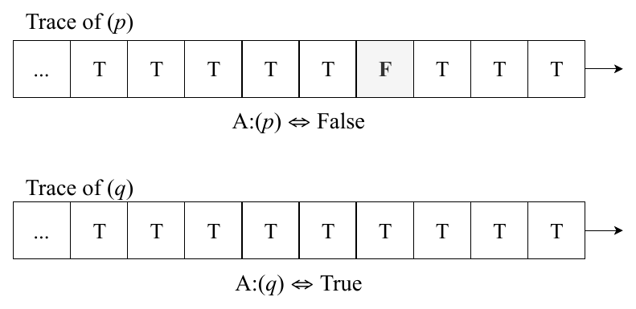
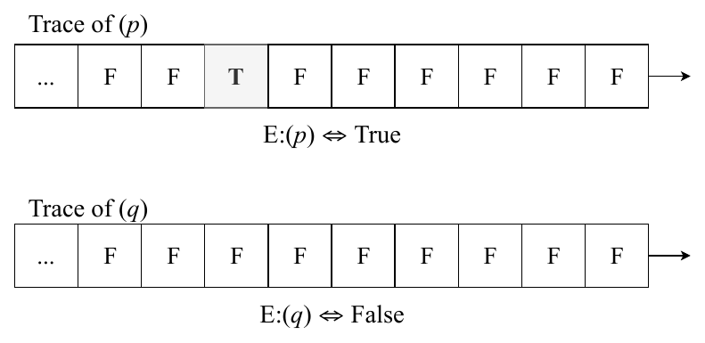
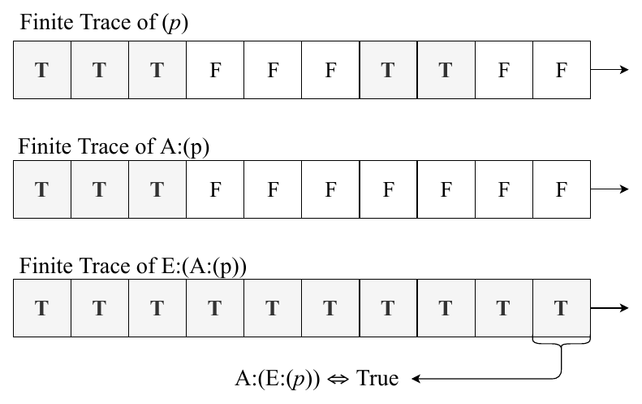
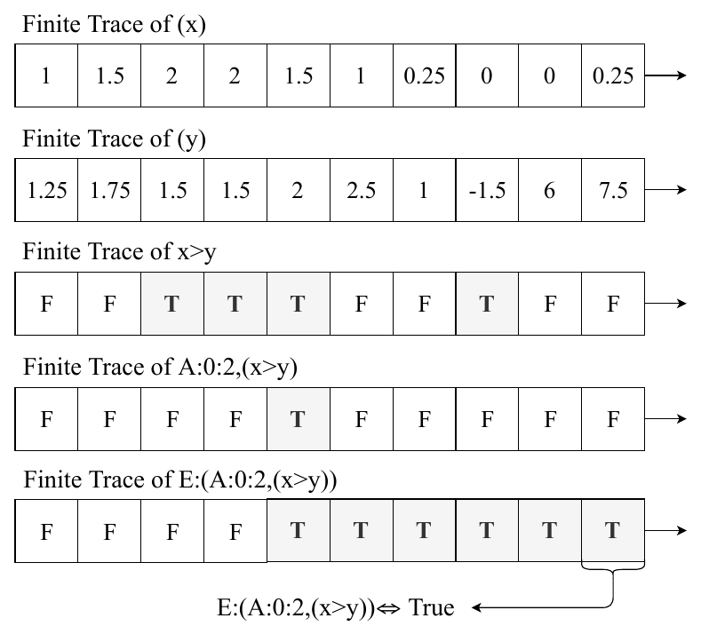
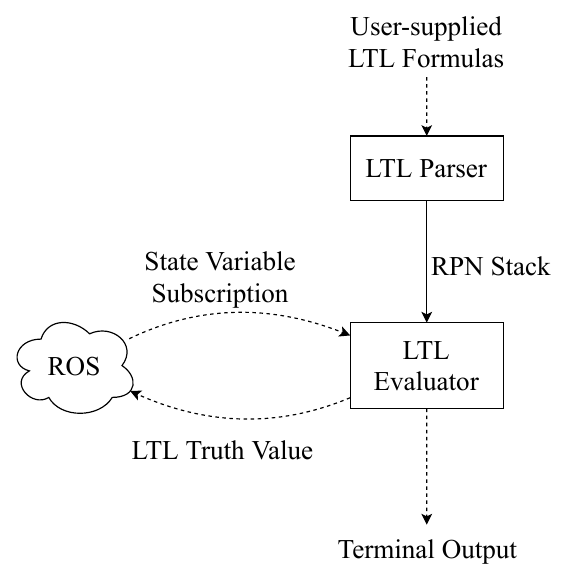
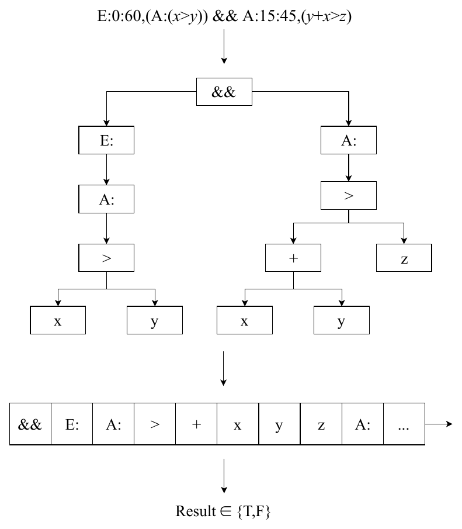
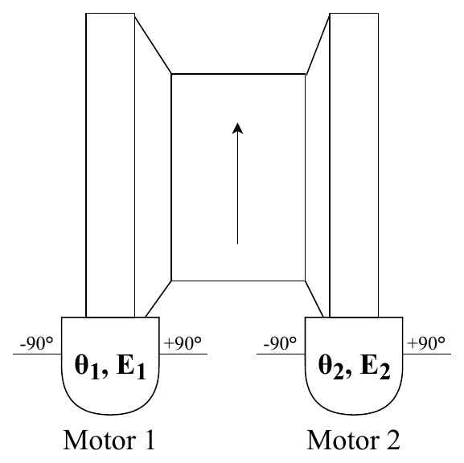
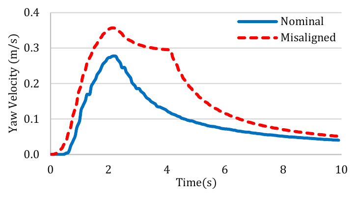
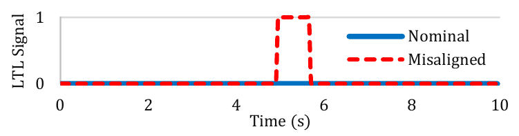

<section class="paper-abstract">
<h2>Abstract</h2>

The proliferation of unmanned vehicle technologies has drastically increased their use in multiple domains. In the maritime domain, unmanned surface vehicles often pose special requirements for on-board health monitoring and fault mitigation due to long endurance, which increases the likelihood of failures when operating without human oversight. Whereas such vehicles can be equipped with numerous on-board sensors, detecting actual or impending failures is often more complicated than simply thresholding values of a sensor reading. In this paper, we will consider the use of Linear Temporal Logic (LTL) as a means to specify and then evaluate in real-time, the health status of an unmanned surface vehicle. This is accomplished by capturing nominal conditions in LTL formulas and then evaluating these formulas in real-time. The advantage of LTL is that it allows capturing value-based as well as time-based expectations for sensor readings when evaluating system status. We define a formal language which is an extension of LTL, and a corresponding software evaluation method with bounded performance. An example demonstration of the feasibility of the process is presented.

</section>

<section id="S1"><h2>I. Introduction</h2>

Monitoring the on-board status of unmanned maritime vehicles can prove challenging, for many reasons. Maritime vehicles operate in a relatively difficult environment in which debris, water spray, corrosion and other factors can degrade the performance of the system in ways that are not always immediately apparent. Furthermore, the use of automatic controllers often hides the onset of problems by compensating for such errors. Addressing such issues is often done by installing sensors that monitor for error conditions; however, there are difficulties in properly interpreting their readings. For example, consider an engine temperature gauge with a pre-set maximum safe limit. Shutting down the system based on that reading alone runs the risk of making an incorrect choice should the gauge itself fail and provide erroneous readings. A different but equally problematic scenario is gauge failure that displays a nominal temperature even though the actual temperature exceeds the safe limit. Because of the propensity of individual sensor failures, it is necessary the cross reference multiple sensor readings over time before making a determination of a fault. When under human supervision, sensor information is typically aggregated by the vehicle and transmitted to a monitoring/control station that displays all sensor readings, pushing the responsibility for making fault assessments and evaluating mission readiness to the human operator. Not only is this a difficult task for a human, but it is not transferable to unsupervised operations during which a vehicle must be able to make a determination of its ability to accomplish its mission autonomously.

Our approach is based on using Linear Temporal Logic (LTL) formulas <a href="#S3">Section III</a> as a means of capturing nominal performance of the overall system. One advantage of LTL over other approaches is that LTL can capture the element of time in addition to fixed-in-time reading. Use of LTL formulas hence allows evaluating the behavior of the system over time and assessing if it operates within nominal parameters based on richer information when compared to point-in-time sensor readings. A key contribution of the paper is an efficient approach to evaluating the LTL formulas allowing their evaluation to be performed on-board the unmanned vessel.

The remaining of the paper is organized as follows: <a href="#S2">Section II</a> overviews related work, <a href="#S3">Section III</a> describes the LTL formalism in general and the specific portion used in our proposed system. <a href="#S4">Section IV</a> outlines the method by which LTL formulas are evaluated in real-time based on sensor readings. <a href="#S5">Section V</a> presents a test case of using LTL formulas to identify a nuanced failure in a maritime unmanned system and <a href="#S6">Section VI</a> concludes.

</section>

<section id="S2"><h2>II. Related Work</h2>

LTL has been used to model correctness properties of low-level software programs <a href="#R1">[1]</a> and robotic motion planning <a href="#R2">[2]</a> <a href="#R3">[3]</a>. Safety properties can be falsified but not proved in general, as in sufficiently complex systems these statements are undecidable <a href="#R4">[4]</a>. In practice, this is avoided by using a <em>bounded</em> variant of LTL known as metric temporal logic. This has been used to find the trajectory of safety properties over time <a href="#R5">[5]</a>. Effectively, the decidability problem is avoided by evaluating safety expressions on a single system trajectory (i.e., a <em>trace</em>) in real-time.

On-board fault detection is also accomplished by using Bayesian networks <a href="#R6">[6]</a>, which consider the probability of the actual fault event as well as the reliability of the sensor, and thus makes a probabilistic estimate of a fault based on multiple sensor readings. One drawback is that a priori probability estimates of faults are needed, as well as relative sensor reliability weightings.

Another common approach for safety monitoring is the “residual method”, whereby a real-time simulated version of the system is compared against the real system <a href="#R7">[7]</a>. The residual (e.g., squared error) between the simulated and real system is computed; if the residual is too large, this indicates that some non-optimal state has been reached. A drawback of the residual approach is that you must model the system, and any errors in doing so, whether arising from system complexity or computational difficulty, may lead to false-positives. As well, it is not obvious how one would in general detect the exact problem that has occured solely from the residual, and indeed that problem has been an area of active research.

Our implementation is an alternative to both the residual and Bayesian methods, whereby one explicitly specifies invariants of how system variables must temporally relate to one another. In this “LTL approach”, an explicit system model or simulation is not necessary, allowing it to be applied to systems intractable or uneconomic to explicitly model.

</section>

<section id="S3"><h2>III. LTL Overview</h2>

LTL is essentially a generalization of Boolean logic, which adds a capability to model “propositions whose truth or falsity may depend on time” <a href="#R8">[8]</a>. Practically, this adds a number of operators which specify temporal relationships between propositions. One way of thinking about temporal logic is that unlike first-order logic, it operates on countably infinite ordered sets <a href="#R9">[9]</a> (i.e., sequences). In convention with the literature, we use the term <em>trace</em> to refer to these sequences, and the term <em>finite trace</em> when the sequence in question has finite size.

Since LTL is a generalization of Boolean logic, it inherits by default all of the common logical connectives intrinsic to that logic, which are enumerated by <a href="#T1">Table I</a>. The so-called “application syntax” refers to the form used in application, chosen due to programming convention, as opposed to the symbolic form used in presentation of this document.

<section class="paper-table" id="T1"><h4 class="obj_head">Table I. Common Logical Connectives</h4>

<table><thead><tr><th>Operator</th><th>Symbol</th><th>Application Syntax</th></tr></thead>
<tbody><tr><td>Not</td><td>\(\lnot p\)</td><td><code>!p</code></td></tr><tr><td>And</td><td>\(p \land q\)</td><td><code>p &amp;&amp; q</code></td></tr><tr><td>Or</td><td>\(p \lor q\)</td><td><code>p || q</code></td></tr></tbody></table>
</section>

In that predicate logic models quantification (e.g., \(\forall\), \(\exists\)), temporal logic models temporal relationships (e.g., A:, E:). The best way to understand the LTL formalism is by example. The arguably simplest temporal operation is A:(<i>p</i>), such that <i>p</i> is an arbitrary boolean proposition with values across time (i.e., a trace). This expression is read as “always”, and simply specifies that <i>p</i> is always true across the trace. <a href="#F1">Figure 1</a> shows a case where A:(<i>p</i>) evaluates to true or false, respectively. In the first example, A:(<i>p</i>) evaluates to false because there exists a time in the past where <i>p</i> was false. In the second example, A:(<i>q</i>) evaluates to true for the opposite reason.

<figure class="paper-fig" id="F1"><h3 class="obj_head">Figure 1.</h3>

<figcaption>
Always Operator on Two Example Traces.
</figcaption></figure>

The second most basic operator is E:(<i>p</i>), which is the dual of A:(<i>p</i>). It is read as “eventually”, and has much the same mathematical meaning: E:(<i>p</i>) is true if <i>p</i> was true at any point in time. These two operators are dual due to the relation \(\lnot \mathrm{A{:}}(p) \Leftrightarrow \mathrm{E{:}}(\lnot p)\). This should make intuitive sense: <i>p</i> was not always true if, and only if, there was a point at which <i>p</i> was false. That operator relationship is a salient similarity between temporal and first-order logic. In much the same way, <a href="#F2">Figure 2</a> exemplifies a set of traces where E:(<i>p</i>) evaluates to true or false, respectively.

<figure class="paper-fig" id="F2"><h3 class="obj_head">Figure 2.</h3>

<figcaption>
Eventually Operator on Two Example Traces.
</figcaption></figure>

The full set of temporal operators considered in our application is described in <a href="#T2">Table II</a>. In addition to the ones already described, there exist three other operators whose illustrated explanation we will omit.

<section class="paper-table" id="T2"><h4 class="obj_head">Table II. Listing of Temporal Operators</h4>

<table><thead><tr><th>Operator</th><th>Syntax</th><th>Description</th></tr></thead>
<tbody><tr><td>Next</td><td>N: <i>p</i></td><td><i>p</i> was true one time-step ago.</td></tr>
<tr><td>Always</td><td>A: <i>p</i></td><td><i>p</i> was always true.</td></tr>
<tr><td>Eventually</td><td>E: <i>p</i></td><td><i>p</i> was eventually true at some point.</td></tr>
<tr><td>Until</td><td><i>p</i> U: <i>q</i></td><td><i>p</i> was true up until just before <i>q</i> was true.</td></tr>
<tr><td>Release</td><td><i>p</i> R: <i>q</i></td><td><i>q</i> was true up until <i>p</i> was true, after which <i>q</i> was false.</td></tr></tbody></table>
</section>

<section id="S3a"><h3>A. Introduction of Boolean Combinations</h3>

The true expressiveness of LTL arises from the ability to nest logical connectives and temporal operators in arbitrary ways. Referring back to <a href="#F1">Figure 1</a>, the result of A:(\(p \lor q\)) is true, because for every false entry in the trace of <i>p</i>, there exists a corresponding <i>q</i> entry that is true at the same time. The expression acted upon by a temporal operator may be any LTL expression, including other temporal operators. For example, in <a href="#F3">Figure 3</a>, we see the intermediate values involved in the expression E:(A:(<i>p</i>)) operating upon a finite trace. A finite trace for this example was chosen only to keep the example simple; it works for general traces equivalently.

The key to understanding this nested temporal expression is that each temporal operator possesses its own trace (Boolean values through time), corresponding to whether or not the subsequence formed by taking the past at each point would result in a true value. However, the proper result of a temporal expression is the last value of the trace; This is indicated by the bottom arrow in <a href="#F3">Figure 3</a>. A conceptual justification for this is that the last value of the trace is what the value is “now”. It is important to note that this interpretation is not unique; it is equally as valid to take the first value of the trace as “now” and consider all other trace values to be future values.

<figure class="paper-fig" id="F3"><h3 class="obj_head">Figure 3.</h3>

<figcaption>
Nested Operator on Finite Trace.
</figcaption></figure>
</section>

<section id="S3b"><h3>B. Introduction of Metric Temporal Logic</h3>

A common way to introduce real-time in the (LTL) syntax is by “replacing the unrestricted time operators by time-bounded versions” <a href="#R10">[10]</a>. This allows for temporal operators to factor a metric of time, and to have essentially a time-bounded range of concern. In addition to making the logic much more expressive, it also has important considerations for real-time evaluation of the logic for practical applications.

We utilize MTL operators by defining some slightly modified syntax. For example, the time-bounded version of “always” is \(\mathrm{A{:}}{}_s^t(p)\) where \(s, t \in \mathbb{Z}^{\geq}\). In our formulation, the 0th entry corresponds to “now”, and all other entries incrementally refer to past values. <a href="#T3">Table III</a> defines the application syntax and mathematical symbology used to denote the metric temporal operators.

<section class="paper-table" id="T3"><h4 class="obj_head">Table III. Syntax of Metric Temporal Operators</h4>

<table><thead><tr><th>Operator</th><th>Symbol</th><th>Application Syntax</th></tr></thead>
<tbody><tr><td>Always</td><td>\(\mathrm{A{:}}{}_s^t(p)\)</td><td><code>A:s:t,(p)</code></td></tr>
<tr><td>Eventually</td><td>\(\mathrm{E{:}}{}_s^t(p)\)</td><td><code>E:s:t,(p)</code></td></tr>
<tr><td>Until</td><td>\(p\,\mathrm{U{:}}{}_s^t\,q\)</td><td><code>p U:s:t, q</code></td></tr>
<tr><td>Release</td><td>\(p\,\mathrm{R{:}}{}_s^t\,q\)</td><td><code>p R:s:t, q</code></td></tr></tbody></table>
</section>
</section>

<section id="S3c"><h3>C. Introduction of State Variables</h3>

The final extensions we include in our formalism are basic arithmetic and relational operations, as well as numerical state variables. State variables are real numbers which possess a real-valued trace (i.e., values through time). Effectively, this allows us to construct expressions which model the temporal relationship of real-valued variables through time. These values can represent sensor readings or other on-board state varibles. A comprehensive example of this capability is illustrated by <a href="#F4">Figure 4</a>, which shows the intermediate values associated with evaluating \(\mathrm{E{:}}(\mathrm{A{:}}{}_0^2(x &gt; y))\), given that \(x, y \in \mathbb{R}\). This expression is equivalent to the existence of a three-unit contiguous time region during which <i>x</i> is larger than <i>y</i>.

<figure class="paper-fig" id="F4"><h3 class="obj_head">Figure 4.</h3>

<figcaption>
Bounded Temporal Expression on State Variables.
</figcaption></figure>
</section>
</section>

<section id="S4"><h2>IV. Method</h2>

Real-time evaluation of the LTL formalism described by <a href="#S3">Section III</a> was implemented via a Robot Operating System (ROS) package developed for the purpose. ROS is a commonly used middleware for developing robotics applications, providing algorithms and visualization tools. Some of the basic functionality provided is message-passing, which is implemented through so-called “ROS topics”, and serves as the basis of the application.

Given user-specified LTL formulas and associated topic names, the program parses and evaluates the formulas, publishing the truth result to the rest of the ROS system. The flow of inputs and outputs involved in this process is illustrated in <a href="#F5">Figure 5</a>. Dotted arrows represent external interfaces to the system.

<figure class="paper-fig" id="F5"><h3 class="obj_head">Figure 5.</h3>

<figcaption>
System Diagram of LTL Parser and Evaluator.
</figcaption></figure>

The evaluation of an LTL expression occurs in two steps, as illustrated in <a href="#F6">Figure 6</a>. Of note is that explicit construction of the abstract-syntax tree is not performed during parsing, but is provided here only for explanation.

<ol><li>The expression is parsed while converting from infix to RPN.</li><li>Variable tokens are replaced with the corresponding data, and the stack machine is executed.</li></ol>
<figure class="paper-fig" id="F6"><h3 class="obj_head">Figure 6.</h3>

<figcaption>
Generation of RPN Stack Machine.
</figcaption></figure>

Parsing is performed via Dijkstra’s shunting-yard algorithm, converting the expression string to an array of Reverse Polish Notation (RPN) tokens. The evaluator then, on each arrival of new data, evaluates the RPN expression using a stack-based postfix evaluation algorithm. Each element of the stack is a trace, and each operator is a function of one or more traces.

When a real number is encountered in the execution, it is interpreted as a trace consisting solely of that real number. Hence, when a variable is introduced and compared to that number, the result is a boolean trace representing the result of that comparison over time. For all arithmetic, relational, and logical operators the result is simply that operator applied pairwise to each element of the two corresponding traces. In the case of 1-arity operators e.g., !<i>p</i>, the operator is simply applied to each element of the trace. For temporal operators, each trace element’s result is a function of the previous elements in the same way as described in <a href="#S3">Section III</a>. Each element of every trace is of real type, and is automatically type cast depending on the operator.

The internal procedure used to calculate the ’Always’ operator is described by <a href="#A1">Algorithm 1</a>. If a boundedness operator is applied the procedure described by Algorithm 1 will operate only on a contiguous subsequence of the input trace. All non-zero real numbers (approximated by floating point) are type cast to <code>true</code> if acted upon by a boolean operator.

<section class="paper-table paper-algorithm" id="A1"><h4 class="obj_head">Algorithm 1. ’Always’ operator. Resultant array is true up until \(x_i\) is false.</h4>
<pre class="paper-algo"><b>function</b> A(\(x\)):
    <b>Input:</b>  Array of reals \(x\) of size \(n\)
    <b>Output:</b> Array of reals, size \(n\)
    boolean: \(\alpha\) = true
    <b>for</b> \(x_i \in x\) <b>do</b>
        \(\alpha = x_i \land \alpha\)
        \(x_i = \mathbb{R}(\alpha)\)
    <b>end</b>
    <b>return</b> \(x\)</pre></section>

We achieve bounded performance by allowing the user to specify the maximum trace size for each LTL formula. Once the trace reaches that size, all LTL formulas, whether they are ultimately bounded or not will only act upon data within the specified time window of the current time. This is to ensure that the computation required to evaluate a given LTL formula is sublinear with respect to the current time of operation. One future work considered is automatic generation of an appropriate maximum trace size given an LTL formula.

</section>

<section id="S5"><h2>V. Results</h2>

This method was applied to an autonomous sea vessel in order to detect motor misalignment conditions, which occur when there exists an offset between the steering control value and the angle between the vessel and one, or both, of the motors. The control interface is a four-vector, with each element controlling the rotation (with respect to the craft) and effort of each of the two motors respectively. We use the term “effort” a percentage of the total power available to the system for acceleration that abstracts away physical details. For context, a simplified diagram of the physical placement of the motors can be seen in <a href="#F7">Figure 7</a>. The controls values are subject to the constraints defined by (1) and (2).

<table class="disp-formula" id="FD1"><tr><td class="formula">\[-100 \geq E_N \leq 100\]</td><td class="label">(1)</td></tr></table>
<table class="disp-formula" id="FD2"><tr><td class="formula">\[-90^{\circ} \geq \theta_N \leq 90^{\circ}\]</td><td class="label">(2)</td></tr></table>
<figure class="paper-fig" id="F7"><h3 class="obj_head">Figure 7.</h3>

<figcaption>
Diagram of Autonomous Vessel in Overhead View.
</figcaption></figure>

The method was implemented as a configurable ROS component, which subscribes to the topics necessary to detect the suboptimal condition. The implementation allows for multiple LTL formulas each corresponding to a set of ROS topics. (3) specifies the LTL formula written to detect the motor misalignment condition, where \(|x|\) specifies the absolute value operation.

<table class="disp-formula" id="FD3"><tr><td class="formula">\[\mathrm{A{:}0{:}60},(E_L = E_R \land |S_L| &lt; 3 \land |S_R| &lt; 3 \land V_{yaw} &gt; 0.3)\]</td><td class="label">(3)</td></tr></table>

We may break (3) into three logical clauses. If the following three conditions are true for the last sixty time units, the motor is misaligned.

<ol><li>The efforts from both motors are equal.</li><li>The steering angles from both motors are less than 3 degrees, and...</li><li>The yaw-velocity of the craft is above a certain threshold.</li></ol>

The LTL formula was applied to two simulations of the autonomous vessel, each under an equivalent control trajectory. In the first (control) simulation, both motors are correctly aligned. In the second, the left motor is misaligned by 10°. The resultant angular velocity of both 10-second simulations is illustrated by <a href="#F8">Figure 8</a>. The difference in yaw velocity, and particularly the spike at 2 seconds in the misaligned case can be attributed to the alignment discrepancy.

The control trajectory applied was generated by a simple driver code. For 2 seconds, an effort value of 50 and 100 was applied to the left and right motors respectively. Then, for the next 2 seconds, an effort value of 100 was applied to both motors for 2 seconds. Finally, the vehicle was allowed to coast under no effort. The control trajectory was chosen to be deterministic and not unlikely to occur during user operation.

<figure class="paper-fig" id="F8"><h3 class="obj_head">Figure 8.</h3>

<figcaption>
Angular Velocity of Nominal vs. Misaligned Case.
</figcaption></figure>

The resultant boolean signal for both the nominal case and misaligned case is seen in <a href="#F9">Figure 9</a>. Due to the to the structure of the LTL formula used, there is a delay present in the result. It is possible to decrease the delay, but at risk of causing false-positives. As in most forms of signal processing, a tradeoff in delay and accuracy is present.

<figure class="paper-fig" id="F9"><h3 class="obj_head">Figure 9.</h3>

<figcaption>
LTL Signal of Nominal vs. Misaligned Case.
</figcaption></figure>

Instead of integrating the squared error between what is expected to happen (via a physics model) with what was observed, i.e., the “residual method”, we write specific temporal scenarios, which would only occur if the condition is present. The LTL approach allows us to both be more specific about error detection, and can be deployed in scenarios where an accurate physics model is intractable to compute.

</section>

<section id="S6"><h2>VI. Conclusion and Future Work</h2>

Autonomous systems require ways to detect, interpret, and even anticipate problems. On-board sensors provide information, but unless there is a trivial interpretation (i.e., battery voltage dropping below a threshold), it is difficult to make a singular assessment about on-board status based on several sensor readings. Furthermore, proper interpretation of sensors cannot be done only for a single time, but must be done over a history. Proper sensor values may be temporally correlated in non-trivial ways. LTL is a convenient formalism for capturing the expected behavior of the system via mathematical modeling. Failures in the system can be directly inferred from evaluating these LTL expressions.

In this paper, we have demonstrated a practical LTL evaluation method that has bounded performance with respect to temporal formula evaluation at given time-points. For tele-operated systems, we view this as a compression scheme to encode high-dimensional temporal data into a form parsable by a human operator controlling the system. For on-board systems, this method effectively addresses the problem of autonomously capturing the nominal performance of the overall system.

There are three major directions planned for future work of this method. Currently, maximum trace size is manually set in order to provide bounded performance. However, it seems possible to automatically derive the maximum trace size from a provided LTL formula. As well, memoization of certain intermediary values may improve on the computational complexity of the method. Finally, a large part of the effort expended in using this method is coming up with a LTL formula that captures the desired behavior. Supervised machine learning techniques could be used to automatically generate an appropriate LTL formula given examples of nominal and “problem” mission trajectories, enabling rapid development of status assessment systems.

</section>

<section id="ref-list" class="ref-list"><h2>References</h2>
<ol>
<li id="R1"><cite>J. Morse, L. Cordeiro, D. Nicole, and B. Fischer, “B.: Context-bounded model checking of LTL properties for ansi-c software,” in <i>SEFM 2011. LNCS</i>. Springer, 2011, pp. 302–317.</cite></li>
<li id="R2"><cite>G. E. Fainekos and H. Kress-gazit, “Temporal logic motion planning for mobile robots,” in <i>In Proceedings of the 2005 IEEE International Conference on Robotics and Automation</i>, 2005, pp. 2020–2025.</cite></li>
<li id="R3"><cite>A. Albore and P. Bertoli, “Safe ltl assumption-based planning,” in <i>In Proc. 16th Int. Conf. on Planning and Scheduling (ICAPS-06</i>.</cite></li>
<li id="R4"><cite>T. A. Henzinger, P. W. Kopke, A. Puri, and P. Varaiya, “What’s decidable about hybrid automata?” in <i>Journal of Computer and System Sciences</i>. ACM Press, 1995, pp. 373–382.</cite></li>
<li id="R5"><cite>J. Schumann, K. Y. Rozier, T. Reinbacher, O. J. Mengshoel, T. Mbaya, E. Al, J. Schumann, K. Y. Rozier, T. Reinbacher, O. J. Mengshoel, and T. Mbaya, “Towards real-time, on-board, hardware-supported sensor and software health management for unmanned aerial systems,” in <i>in Proceedings of the 2013 Annual Conference of the Prognostics and Health Management Society (PHM2013</i>, 2013.</cite></li>
<li id="R6"><cite>R. Zhang, X. Hu, H. Wang, and H. Yao, “Fault diagnosis method in complex system using bayesian networks sensitivity analysis,” <i>Information Technology Journal</i>, vol. 14, pp. 24–30, 01 2015.</cite></li>
<li id="R7"><cite>R. Reiter, “A theory of diagnosis from first principles,” 1987.</cite></li>
<li id="R8"><cite>F. Kröger, <i>Temporal Logic of Programs</i>, ser. EATCS Monographs on Theoretical Computer Science. Springer, 1987, vol. 8.</cite></li>
<li id="R9"><cite>E. A. Emerson, “Temporal and modal logic,” in <i>Handbook of Theoretical Computer Science</i>. Elsevier, 1995, pp. 995–1072.</cite></li>
<li id="R10"><cite>R. Alur and T. A. Henzinger, “Logics and models of real time: A survey,” 1992.</cite></li>
</ol></section>
