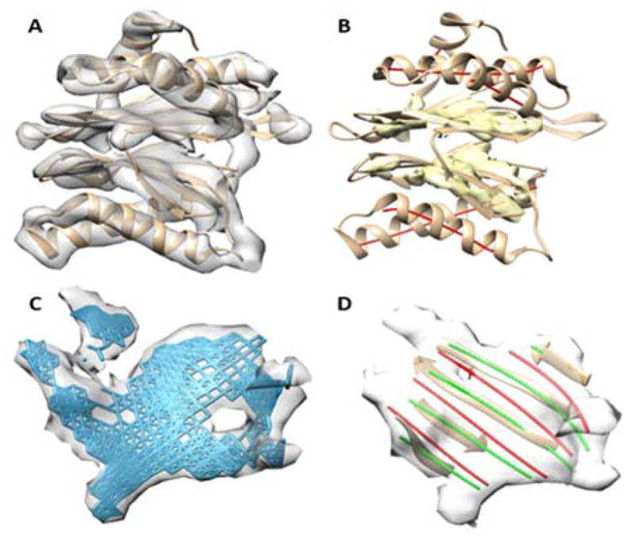
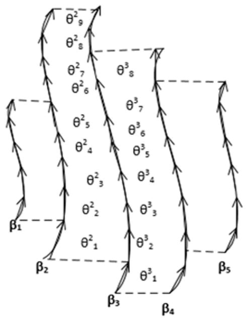
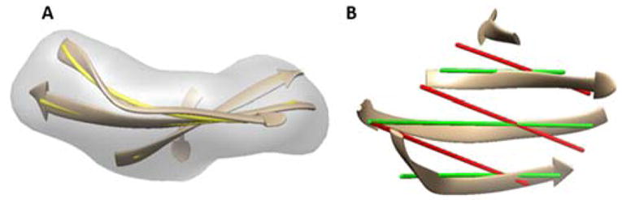
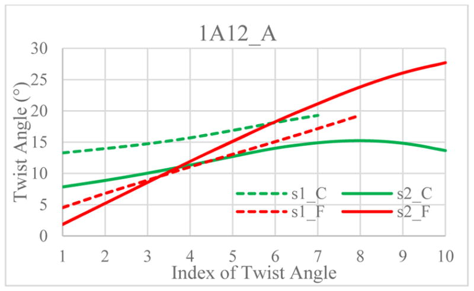
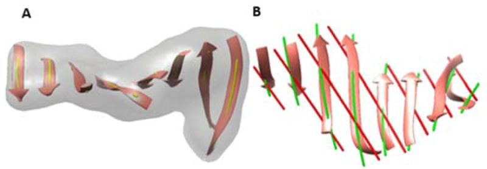
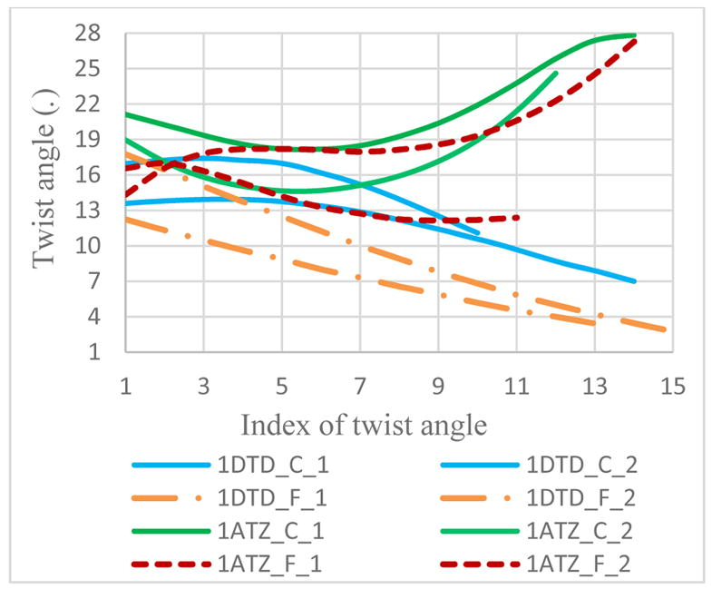
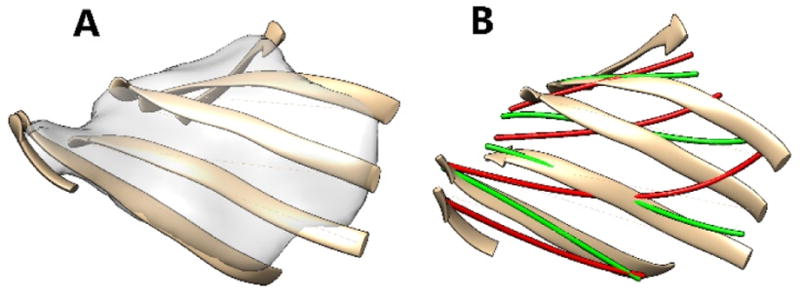

<section class="paper-abstract">
<h2>Abstract</h2>

Electron cryo-microscopy (Cryo-EM) technique produces density maps that are 3-dimensional (3D) images of molecules. It is challenging to derive atomic structures of proteins from 3D images of medium resolutions. Twist of a β-strand has been studied extensively while little of the known information has been directly obtained from the 3D image of a β-sheet. We describe a method to characterize the twist of β-strands from the 3D image of a protein. An analysis of 11 β-sheet images shows that the Averaged Minimum Twist (AMT) angle is larger for a close set than for a far set of β-traces.

</section>

<section id="S1"><h2>1 INTRODUCTION</h2>

3-dimensional (3D) molecular images of large biological assemblies are produced and archived in the Electron Microscopy Data Bank (EMDB) [<a href="#R12">12</a>]. As of April 2017, EMDB contains 4730 entries of 3D images (density maps) of molecules. Most of the 3D images with a higher than 10Å resolution are produced using cryo-electron microscopy (cryo-EM). This technique is particularly suitable for structure determination of large molecular assemblies that are often challenging for traditional methods such as X-ray crystallography and Nuclear Magnetic Resonance (NMR). Some recently solved atomic structures from high resolution images include the complex of β-galactosidase and inhibitor (2.2Å resolution) [<a href="#R5">5</a>], bacteriophage Sf6 (2.9Å resolution) [<a href="#R26">26</a>], and P22 bacteriophage (3.3Å resolution) [<a href="#R10">10</a>]. EMDB is linked with Protein Data Bank (PDB). It is possible to obtain a data set that contains both 3D images (from the EMDB) and their corresponding atomic models (from the PDB).

Although atomic structures are being routinely solved from density maps with sufficient quality, it is computationally challenging to derive atomic structures from density maps at medium resolutions (5–10 Å). Existing approaches require fitting a known atomic structure into the Cryo-EM density map [<a href="#R18">18</a>; <a href="#R24">24</a>; <a href="#R25">25</a>]. De novo methods do not rely on template structures; rather, rely on the intrinsic relationship among secondary structures to construct the backbone of the protein [<a href="#R1">1</a>–<a href="#R3">3</a>; <a href="#R6">6</a>].

Major secondary structures such as helices and β-sheets are visible in density maps of medium resolutions. An α-helix often appears as a cylinder in a density map of medium resolutions. Various methods have been developed to evaluate cylindrical character in the 3D image [<a href="#R4">4</a>; <a href="#R8">8</a>; <a href="#R11">11</a>; <a href="#R13">13</a>; <a href="#R17">17</a>; <a href="#R19">19</a>; <a href="#R23">23</a>]. Recently a deep learning method was developed using a convolutional neural network [<a href="#R13">13</a>]. A β-sheet may appear as a thin layer of density (<a href="#F1">Fig. 1A</a>). Each β-sheet is composed of multiple β-strands with an inter-strand distance of 4.5Å–5Å. A β-strand possesses a right-handed twist [<a href="#R7">7</a>], resulting in a non-flat structure of a β-sheet [<a href="#R9">9</a>; <a href="#R16">16</a>]. This property may be visible in a medium-resolution image. Although a β-sheet is not as characteristic as a helix in an image, computational methods exist to detect major region of a β-sheet [<a href="#R4">4</a>; <a href="#R19">19</a>; <a href="#R23">23</a>]. <a href="#F1">Fig. 1B</a> shows an example of detected β-sheet region (yellow) using SSETracer [<a href="#R19">19</a>].

<figure class="paper-fig" id="F1"><h3 class="obj_head">Figure 1.</h3>

<figcaption>
3D image of cryo-electron microscopy density map, the atomic structure of a protein chain, and segmented secondary structures based on characteristic density patterns. (A): The density map (gray) extracted from Electron microscopy Data Bank 1733 (6.8 Å resolution) superimposed on its atomic structure (ribbon; PDB 3C91 chain H). (B): Segmented helices (represented as red sticks) and two β-sheets (yellow density), using SSETracer [<a href="#R19">19</a>]. (C): The iteratively derived Bézier surface (blue) from β-sheet image (gray) that corresponds to sheet Q. (D): Two sets of β-traces (green and red lines) that were derived from the Bézier surface are superimposed on the atomic structure of β-strands (ribbon) and the image.
</figcaption></figure>
Due to the spacing of β-strands (about 4.5–5Å), it is almost impossible to distinguish the location of β-strands from a density map with lower than 5Å resolution. We previously showed that right-handed twist of β-sheet is effective in elimination of wrong candidate sets of β-strands [<a href="#R21">21</a>]. We recently have showed that it is also possible to predict β-strand traces from β-barrel images utilizing the nature of barrels [<a href="#R22">22</a>]. However, it is still an open question as to how to distinguish the best candidate among a pool of candidate β-strands that are all right-handed twisted to slightly different levels. An important question is how to measure twist angles accurately for a set of lines. Twist angles are slightly different when measured at different locations of the lines. We previously used one angle at the central region of a pair of lines [<a href="#R20">20</a>]. In this paper, we sample many angles along a pair of lines and analyze the behavior of twist angles for two types of sets: sets close and far from the realistic positions of the β-strands.
</section><section id="S2"><h2>2 METHOD</h2>
<section id="S3"><h3>2.1 Computing twist angles from 3D image of a β-sheet</h3>

In order to represent twist angles precisely, a 3D image of the β-sheet was first converted to a surface using iterative Bézier fitting [<a href="#R15">15</a>] or a polynomial fitting [<a href="#R21">21</a>]. Once the surface is optimized, a set of lines was generated from the surface to mimic traces of β-strands. We refer to the set of such generated lines as β-traces. One set of β-traces may differ from another set by orientation or by translation. It is important to distinguish the set that is closest to the actual set representing the atomic structure of β-strands.

Let β-strand traces be <em>β</em>1, <em>β</em>2, …, <em>βm</em>, and let 

<math display="inline" id="M1" overflow="linebreak"><mrow><msubsup><mi>θ</mi><mi>j</mi><mi>i</mi></msubsup></mrow></math> be the angle formed by <em>βi</em> and <em>βi</em>+1 at location <em>j</em> of <em>βi</em>, 1 ≤ <em>i</em> &lt; <em>m</em>, 1 ≤ <em>j</em> ≤ <em>ni</em>. As an example, the angles formed by <em>β</em>1 and <em>β</em>2 along the strands are (

<math display="inline" id="M2" overflow="linebreak"><mrow><msubsup><mi>θ</mi><mn>1</mn><mn>1</mn></msubsup><mo>,</mo><msubsup><mi>θ</mi><mn>2</mn><mn>1</mn></msubsup><mo>,</mo><mo>…</mo><mo>,</mo><msubsup><mi>θ</mi><msub><mi>n</mi><mn>1</mn></msub><mn>1</mn></msubsup></mrow></math>). We divided a line of β-trace into consecutive vectors of certain length, and calculated the angle formed by two vectors from adjacent traces, as illustrated in <a href="#F2">Fig. 2</a>. The longest pairing length of a pair of β-traces was determined for each two neighboring traces. Note that the longest pairing length is often different from the individual length of each trace due to the relative position of the two lines. Since longer pairs of β-strands are major components of a β-sheet, we used the two longest pairs of β-traces to calculate an overall twist angle of a set of β-traces. Note that since the level of twist is often different at different locations of a β-sheet, a consistent measure of twist is needed to compare the level of twist created by different sets of β-traces. We define an averaged minimum twist (AMT), &amp;<em>tau;</em>, for each set of β-traces as in (<a href="#FD1">1</a>). The idea of AMT is that the region with the minimum twist is the most stable spot for a pair of β-traces, and the two longest pairs formed by <em>β</em><em>i</em>1, <em>β</em><em>i</em>1+1, and <em>β</em><em>i</em>2, <em>β</em><em>i</em>2+1 respectively were used for representing the major region of a β-sheet.

<figure class="paper-fig" id="F2"><h4 class="obj_head">Figure 2.</h4>

<figcaption>
Twist angle calculation. The pairing length of two neighboring β-traces are marked with dashed lines.
</figcaption></figure><table class="disp-formula" id="FD1"><tr>
<td class="formula"><math display="block" id="M3" overflow="linebreak"><mrow><mi>τ</mi><mo>=</mo><mfrac><mn>1</mn><mn>2</mn></mfrac><mspace width="0.16667em"></mspace><mo stretchy="false">(</mo><msub><mi mathvariant="italic">min</mi><msub><mi>k</mi><mn>1</mn></msub></msub><munderover><mo>∑</mo><mrow><msub><mi>j</mi><mn>1</mn></msub><mo>=</mo><msub><mi>k</mi><mn>1</mn></msub></mrow><mrow><msub><mi>k</mi><mn>1</mn></msub><mo>+</mo><mi>p</mi></mrow></munderover><mfrac><msubsup><mi>θ</mi><msub><mi>j</mi><mn>1</mn></msub><msub><mi>i</mi><mrow><mn>1</mn><mo>,</mo></mrow></msub></msubsup><mi>p</mi></mfrac><mo>+</mo><msub><mi mathvariant="italic">min</mi><msub><mi>k</mi><mn>2</mn></msub></msub><munderover><mo>∑</mo><mrow><msub><mi>j</mi><mn>2</mn></msub><mo>=</mo><msub><mi>k</mi><mn>2</mn></msub></mrow><mrow><msub><mi>k</mi><mn>2</mn></msub><mo>+</mo><mi>q</mi></mrow></munderover><mfrac><msubsup><mi>θ</mi><msub><mi>j</mi><mn>2</mn></msub><msub><mi>i</mi><mrow><mn>2</mn><mo>,</mo></mrow></msub></msubsup><mi>q</mi></mfrac><mo stretchy="false">)</mo></mrow></math></td>
<td class="label">(1)</td>
</tr></table>

Here, <em>p</em> and <em>q</em> are parameters, for which we used 4 in this paper. The choice of <em>p</em> and <em>q</em> is related to the length of the vector in angle calculation.
</section><section id="S4"><h3>2.2 Twist calculation using splines of β-strands</h3>

Given the atomic structure of a protein, one way to calculate the twist angle is to use two vectors, one from each of two neighboring β-strands [<a href="#R9">9</a>]. The vector is defined by the two mid-points of consecutive C-N bonds along the β-strand. In order to characterize the AMT of a set of lines that precisely represent β-strands, we derived splines for β-strands. A cubic spline of a β-strand was calculated using mid-points of C-N bonds on the β-strand. Once the splines were generated, AMT was calculated. Note that the process of generating β-strand splines is different from the process of generating β-traces. One uses the atomic structure of β-strands, while the other uses 3D image of the β-sheet. In order to generate a robust AMT for β-strand splines, we measured the AMT three times and took an average. Each pass of the AMT was calculated by shifting the beginning of the line by one, two, or three points on the line.
</section></section><section id="S5"><h2>3 RESULTS</h2>

Ten β-sheet images were generated using atomic structures of the β-sheets and Chimera [<a href="#R14">14</a>] to a 10Å resolution. The data set represents small to large β-sheets, each of which has three to nine β-strands. StrandTwister was used to generate candidate sets of β-traces. StrandTwister only returns β-traces that have right-handed twist. The close set of β-traces aligns better with the atomic structure of β-strands than the far set, since it is selected based on the smallest overall distance between atoms of β-strands and the β-traces [<a href="#R21">21</a>]. As an example, the close set of 1A12 sheet A appears to align much better than the far set with a visual inspection in <a href="#F3">Fig. 3</a>.

<figure class="paper-fig" id="F3"><h3 class="obj_head">Figure 3.</h3>

<figcaption>
Twist analysis for β-strand splines, the close set, and the far set of β-traces. (A): The 3D image (gray) of β-sheet A of 1A12 (PDB ID), the atomic structure of β-strands (ribbon), and the β-strand splines (yellow lines) derived from the atomic structure. (B): The atomic structure (ribbon), the close set (green) and the far set of β-traces (red) derived from the 3D image of the β-sheet. Two different views of the same β-sheet are shown in (A) and (B) respectively.
</figcaption></figure><section id="S6"><h3>3.1 Twist angles along a pair of β-traces</h3>

The magnitude of twist is often different at different locations of a β-strand. We investigated twist angles measured along a pair of β-traces for both the close set and the far set. Since most short pairs are near the edge, the most challenging region of the β-sheet, we focused on the longest pairs. For each set, the twist angles of two longest pairs are calculated. In the case of 1A12 sheet A, as shown in <a href="#F4">Fig. 4</a>, the longest pair has twist angles between 7.8° and 15.3° for the close set, and between 1.9° and 27.7° for the far set. Note that both pairs are on the same surface, but they show different levels of twist depending on where they are located on the surface due to twist of the surface. In this case, the region with the smallest twist is on the left side of the curve for the close set (solid green curve). This is the similar region with the smallest twist in the far set (solid red curve) (<a href="#F4">Fig. 4</a>). If we compare the smallest twist of the longest pair between the close set and the far set, the close set would have bigger twist.

<figure class="paper-fig" id="F4"><h4 class="obj_head">Figure 4.</h4>

<figcaption>
Twist angles along a pair of β-traces. Twist angles of the two longest pairs of β-traces in 1A12 (PDB ID) sheet A. The longest pair (S2) and the second longest pair (S1) of β-traces are shown for the close set (green) and far set (red).
</figcaption></figure>
1DTD sheet A has eight β-strands. For the close set of 1DTD, as shown as green lines in <a href="#F5">Fig. 5B</a>, the twist angles of the longest pair of β-traces (longest blue line in <a href="#F6">Fig. 6</a>) are between 7° and 14°. The second longest pair (blue line in <a href="#F6">Fig. 6</a>) has twist angles between 11° and 18°. Twist angles along a pair of β-traces show the challenge of twist analysis. The longest pair in a close set does not always have larger twist angles than the longest pair in a far case. In fact the two lines may cross (longest solid line and longest dashed line) indicating that in certain regions one has bigger twist than the other. However, if both the longest and the second longest pairs are considered, solid lines in <a href="#F6">Fig. 6</a> appear to out-twist corresponding dashed lines if AMT is calculated. <a href="#F7">Fig. 7</a> shows two sets of β-traces for 1ATZ sheet A.

<figure class="paper-fig" id="F5"><h4 class="obj_head">Figure 5.</h4>

<figcaption>
Twist analysis of β-strand splines, the close set, and the far set of β-traces 1DTD (PDB ID) sheet A. Colors and lines are annotated as in <a href="#F3">Fig. 3</a>.
</figcaption></figure><figure class="paper-fig" id="F6"><h4 class="obj_head">Figure 6.</h4>

<figcaption>
Twist angles along a pair of β-traces. Twist angles were calculated for the longest and the second longest pair of β-traces for a close set (solid lines) and a far set (dashed lines) in two cases: 1DTD sheet A (green lines) and 1ATZ sheet A (blue lines).
</figcaption></figure><figure class="paper-fig" id="F7"><h4 class="obj_head">Figure 7.</h4>

<figcaption>
The close set and the far set of β-traces for 1ATZ (PDB ID) sheet A. Annotation method for color and lines is as in <a href="#F3">Fig. 3</a>.
</figcaption></figure></section><section id="S7"><h3>3.2 Twist characterization for simulated β-sheet images</h3>

In order to distinguish two sets of β-traces, we defined AMT to characterize the regional twist of a β-sheet. As an example for 1A12 sheet A, The AMT shows 11.98° for the close set, larger than that of the far set of 7.36° in <a href="#T1">Table 1</a>. We observed similar pattern for β-sheet A of 1DTD that has eight β-strands. The close set (green lines in <a href="#F5">Fig. 5B</a>) has an AMT of 10.75°, and the far set (red lines in <a href="#F5">Fig. 5B</a>) has an AMT of 4.07° in <a href="#T1">Table 1</a>. In all the eleven cases, we observed that the close set of β-traces shows larger AMT than the far set (<a href="#T1">Table 1</a> column 4 and 5).

<section class="paper-table" id="T1"><h4 class="obj_head">Table 1.</h4>

Average Minimum Twist angle of three sets of lines: the set of β-strand splines, two sets of β-traces.

<table frame="hsides" rules="groups">
<thead><tr>
<th align="left" colspan="1" rowspan="1" valign="middle">ID<a href="#TFN1">a</a>
</th>
<th align="left" colspan="1" rowspan="1" valign="middle">Str<a href="#TFN2">b</a>
</th>
<th align="left" colspan="1" rowspan="1" valign="middle">AMT std<a href="#TFN3">c</a>
</th>
<th align="left" colspan="1" rowspan="1" valign="middle">AMT close<a href="#TFN4">d</a>
</th>
<th align="left" colspan="1" rowspan="1" valign="middle">AMT far<a href="#TFN5">e</a>
</th>
<th align="left" colspan="1" rowspan="1" valign="middle">AMT diff<a href="#TFN6">f</a>
</th>
</tr></thead>
<tbody>
<tr>
<td align="left" colspan="1" rowspan="1" valign="top">1B3A_B</td>
<td align="left" colspan="1" rowspan="1" valign="top">3</td>
<td align="left" colspan="1" rowspan="1" valign="top">27.22</td>
<td align="left" colspan="1" rowspan="1" valign="top">9.76</td>
<td align="left" colspan="1" rowspan="1" valign="top">4.69</td>
<td align="left" colspan="1" rowspan="1" valign="top">5.07</td>
</tr>
<tr>
<td align="left" colspan="1" rowspan="1" valign="top">1A12_A</td>
<td align="left" colspan="1" rowspan="1" valign="top">4</td>
<td align="left" colspan="1" rowspan="1" valign="top">27.24</td>
<td align="left" colspan="1" rowspan="1" valign="top">11.98</td>
<td align="left" colspan="1" rowspan="1" valign="top">7.36</td>
<td align="left" colspan="1" rowspan="1" valign="top">4.62</td>
</tr>
<tr>
<td align="left" colspan="1" rowspan="1" valign="top">1AOP_A</td>
<td align="left" colspan="1" rowspan="1" valign="top">5</td>
<td align="left" colspan="1" rowspan="1" valign="top">24.12</td>
<td align="left" colspan="1" rowspan="1" valign="top">2.81</td>
<td align="left" colspan="1" rowspan="1" valign="top">1.28</td>
<td align="left" colspan="1" rowspan="1" valign="top">1.53</td>
</tr>
<tr>
<td align="left" colspan="1" rowspan="1" valign="top">1AKY_A</td>
<td align="left" colspan="1" rowspan="1" valign="top">5</td>
<td align="left" colspan="1" rowspan="1" valign="top">23.40</td>
<td align="left" colspan="1" rowspan="1" valign="top">7.54</td>
<td align="left" colspan="1" rowspan="1" valign="top">6.16</td>
<td align="left" colspan="1" rowspan="1" valign="top">1.38</td>
</tr>
<tr>
<td align="left" colspan="1" rowspan="1" valign="top">1ATZ_A</td>
<td align="left" colspan="1" rowspan="1" valign="top">6</td>
<td align="left" colspan="1" rowspan="1" valign="top">16.70</td>
<td align="left" colspan="1" rowspan="1" valign="top">16.62</td>
<td align="left" colspan="1" rowspan="1" valign="top">12.37</td>
<td align="left" colspan="1" rowspan="1" valign="top">4.25</td>
</tr>
<tr>
<td align="left" colspan="1" rowspan="1" valign="top">1CHD_SH1</td>
<td align="left" colspan="1" rowspan="1" valign="top">7</td>
<td align="left" colspan="1" rowspan="1" valign="top">12.97</td>
<td align="left" colspan="1" rowspan="1" valign="top">6.40</td>
<td align="left" colspan="1" rowspan="1" valign="top">1.79</td>
<td align="left" colspan="1" rowspan="1" valign="top">4.61</td>
</tr>
<tr>
<td align="left" colspan="1" rowspan="1" valign="top">1ELU_B</td>
<td align="left" colspan="1" rowspan="1" valign="top">7</td>
<td align="left" colspan="1" rowspan="1" valign="top">21.02</td>
<td align="left" colspan="1" rowspan="1" valign="top">7.76</td>
<td align="left" colspan="1" rowspan="1" valign="top">3.88</td>
<td align="left" colspan="1" rowspan="1" valign="top">3.88</td>
</tr>
<tr>
<td align="left" colspan="1" rowspan="1" valign="top">1D5T_A</td>
<td align="left" colspan="1" rowspan="1" valign="top">7</td>
<td align="left" colspan="1" rowspan="1" valign="top">16.34</td>
<td align="left" colspan="1" rowspan="1" valign="top">10.88</td>
<td align="left" colspan="1" rowspan="1" valign="top">8.09</td>
<td align="left" colspan="1" rowspan="1" valign="top">2.79</td>
</tr>
<tr>
<td align="left" colspan="1" rowspan="1" valign="top">1DTD_A</td>
<td align="left" colspan="1" rowspan="1" valign="top">8</td>
<td align="left" colspan="1" rowspan="1" valign="top">13.21</td>
<td align="left" colspan="1" rowspan="1" valign="top">10.75</td>
<td align="left" colspan="1" rowspan="1" valign="top">4.07</td>
<td align="left" colspan="1" rowspan="1" valign="top">6.68</td>
</tr>
<tr>
<td align="left" colspan="1" rowspan="1" valign="top">1QNA_C</td>
<td align="left" colspan="1" rowspan="1" valign="top">9</td>
<td align="left" colspan="1" rowspan="1" valign="top">22.99</td>
<td align="left" colspan="1" rowspan="1" valign="top">16.62</td>
<td align="left" colspan="1" rowspan="1" valign="top">8.12</td>
<td align="left" colspan="1" rowspan="1" valign="top">8.50</td>
</tr>
<tr>
<td align="left" colspan="1" rowspan="1" valign="top">EMD1733-3C91_H_Q</td>
<td align="left" colspan="1" rowspan="1" valign="top">5</td>
<td align="left" colspan="1" rowspan="1" valign="top">21.69</td>
<td align="left" colspan="1" rowspan="1" valign="top">9.70</td>
<td align="left" colspan="1" rowspan="1" valign="top">8.97</td>
<td align="left" colspan="1" rowspan="1" valign="top">0.73</td>
</tr>
</tbody>
</table>

a
the PDB/EMDB and sheet ID of the protein;

b
number of strands in a β-sheet;

c
average of minimum twist angle (in degrees) for splines of β-strands;

d
average minimum twist angle (in degrees) for a close set;

e
average minimum twist angle (in degrees) for a far set;

f
difference (in degrees) between d and e.

</section>
The difference of AMT between a close set and a far set is shown in column 6 of <a href="#T1">Table 1</a>. We analyze three cases that are shown in <a href="#F1">Fig. 1</a>, <a href="#F3">Fig. 3</a>, and <a href="#F5">Fig. 5</a>. The difference of AMT shows 0.73° (EMD1733 chain H Sheet Q), 4.62° (1A12_A), and 6.68° (1DTD_A). A visual examination of the three cases show that the smallest difference in AMT of 0.73° corresponds to similar orientation and position between the close set and far set (<a href="#F1">Fig. 1D</a>). In this case, the two sets are mostly different by a translation with the orientations being similar. The largest difference in AMT of 6.68° correlates with the large difference between the close set and the far set, particularly at major region where longest lines are located (<a href="#F5">Fig. 5B</a>). By relating the difference of AMT (column 6 of <a href="#T1">Table 1</a>) with visual examination for the three cases (shown in <a href="#F1">Fig. 1</a>, <a href="#F3">Fig. 3</a>, and <a href="#F5">Fig. 5</a>), we observed that the measurement of AMT was able to distinguish the level of closeness between sets across different cases.
</section><section id="S8"><h3>3.3 Twist characterization for a β-sheet image of a cryo-EM density map</h3>

The cryo-EM density map (EMD-1733) was downloaded from EMDB, and the corresponding structure 3C91 (PDB ID) was downloaded from PDB. Chain H of 3C91 was used as a mask to isolate the density region corresponding to the chain in <a href="#F1">Fig. 1A</a>. SSETracer [<a href="#R19">19</a>] was used to detect the location of α-helices (red lines in <a href="#F1">Fig. 1B</a>) and β-sheet (yellow in <a href="#F1">Fig. 1B</a>). Since the two β-sheet regions detected by SSETracer are naturally separate, we used one of them (sheet Q of chain H) in this case study. Iterative Bézier fitting was performed to derive a surface (blue in <a href="#F1">Fig. 1C</a>) for the 3D image of sheet Q [<a href="#R15">15</a>]. Two sets of β-traces were constructed on the Bézier surface. One set of β-traces (green lines in <a href="#F1">Fig. 1D</a>), referred to the close set, appears to align better with the atomic structure (ribbon in <a href="#F1">Fig. 1D</a>) than the other set (red lines in <a href="#F1">Fig. 1D</a>), referred to the far set. We tested if the two sets can be distinguished using the estimation we defined in (3). We observed that by quantifying twist at the stable region of a pair of β-traces, a close set of β-traces shows bigger twist than a far set. The close set has an AMT of 9.70°, slightly larger than 8.97° for the far set <a href="#T1">Table 1</a>. A visual examination between the two sets show similar orientation between the two sets in <a href="#F1">Fig. 1D</a>, yet AMT detected slight difference between the two. Since β-strand splines were derived directly from atomic structure of β-strands, they are expected to align with β-strands quite accurately. A measure of the AMT for β-strand splines shows 21.69° in <a href="#T1">Table 1</a>. We observe that the AMT of β-strand splines is even larger than that of the close set. This case study suggests that AMT might be suitable for distinguishing a set of β-traces that aligns well with the atomic structure of β-strands.
</section></section><section id="S9"><h2>4 CONCLUSIONS</h2>

β-strands are naturally twisted. Given the 3D image of a β-sheet, there are many ways to generate β-traces from the image to satisfy the inter-trace distance of 4.5 to 5Å. Multiple sets of β-traces need to be generated using a reference surface that captures the overall shape of the 3D image. One set of β-traces may differ from another set mostly by orientation or by translation. We investigated a method to distinguish a close set from a far set, and observed from 11 test cases that the AMT is larger for a close set of β-traces than for a far set. This suggests that AMT can be a potential measure to identify most accurate β-traces from a pool of candidates. Additional measures may be combined for accurate detection of β-strands from medium-resolution images of β-sheets.
</section><section id="S10"><h2>Acknowledgments</h2>

The work in this paper was supported in part by NSF DBI-1356621, NIH R01-GM062968, Modeling and Simulation Scholarship (to TI) and Honors College Undergraduate Research Scholarship (to MP) of Old Dominion University.
</section><section id="fn-group1"><h2>Footnotes</h2>

<strong>CCS CONCEPTS</strong>
<ul id="L1" style="list-style-type:disc">
<li>

<strong>Pattern Recognition</strong> → <strong>Models</strong> → Geometric; Structural;
</li>
<li>

<strong>Simulation and Modeling</strong> → General
</li>
</ul>

</section><section id="ref-list1"><h2>References</h2>
<section id="ref-list1_sec2"><ul style="list-style-type:none">
<li id="R1">
1.<cite>ABEYSINGHE S, JU T, BAKER ML, CHIU W. Shape modeling and matching in identifying 3D protein structures. Computer Aided-design. 2008;40:708–720.</cite></li>
<li id="R2">
2.<cite>AL NASR K, RANJAN D, ZUBAIR M, CHEN L, HE J. Sovling the secondary structure matching problem in cryo-EM de novo modeling using a constrained K-shortest path graph algorithm. IEEE/ACM Trans Comput Biol Bioinform. 2014;11(2):419–429. doi: 10.1109/TCBB.2014.2302803.</cite> [<a href="https://doi.org/10.1109/TCBB.2014.2302803">doi</a>]</li>
<li id="R3">
3.<cite>AL NASR K, RANJAN D, ZUBAIR M, HE J. Ranking valid topologies of the secondary structure elements using a constraint graph. J Bioinform Comput Biol. 2011 Jun;9(3):415–430. doi: 10.1142/s0219720011005604.</cite> [<a href="https://doi.org/10.1142/s0219720011005604">doi</a>]</li>
<li id="R4">
4.<cite>BAKER ML, JU T, CHIU W. Identification of secondary structure elements in intermediate-resolution density maps. Structure. 2007 Jan;15(1):7–19. doi: 10.1016/j.str.2006.11.008.</cite> [<a href="https://doi.org/10.1016/j.str.2006.11.008">doi</a>]</li>
<li id="R5">
5.<cite>BARTESAGHI A, MERK A, BANERJEE S, MATTHIES D, WU X, MILNE JLS, SUBRAMANIAM S. 2.2 Å resolution cryo-EM structure of β-galactosidase in complex with a cell-permeant inhibitor. Science. 2015;348(6239):1147–1151. doi: 10.1126/science.aab1576.</cite> [<a href="https://doi.org/10.1126/science.aab1576">doi</a>]</li>
<li id="R6">
6.<cite>BISWAS A, RANJAN D, ZUBAIR M, ZEIL S, NASR KA, HE J. An Effective Computational Method Incorporating Multiple Secondary Structure Predictions in Topology Determination for Cryo-EM Images. IEEE/ACM Transactions on Computational Biology and Bioinformatics. 2016;14(3):578–586. doi: 10.1109/TCBB.2016.2543721.</cite> [<a href="https://doi.org/10.1109/TCBB.2016.2543721">doi</a>]</li>
<li id="R7">
7.<cite>CHOTHIA C. Conformation of twisted beta-pleated sheets in proteins. J Mol Biol. 1973 Apr 5;75(2):295–302. doi: 10.1016/0022-2836(73)90022-3.</cite> [<a href="https://doi.org/10.1016/0022-2836(73)90022-3">doi</a>]</li>
<li id="R8">
8.<cite>DAL PALU A, HE J, PONTELLI E, LU Y. Identification of Alpha-Helices from Low Resolution Protein Density Maps. Proceeding of Computational Systems Bioinformatics Conference(CSB) 2006:89–98.</cite></li>
<li id="R9">
9.<cite>HO BK, CURMI PM. Twist and shear in beta-sheets and beta-ribbons. J Mol Biol. 2002 Mar 22;317(2):291–308. doi: 10.1006/jmbi.2001.5385.</cite> [<a href="https://doi.org/10.1006/jmbi.2001.5385">doi</a>]</li>
<li id="R10">
10.<cite>HRYC CF, CHEN DH, AFONINE PV, JAKANA J, WANG Z, HAASE-PETTINGELL C, JIANG W, ADAMS PD, KING JA, SCHMID MF, CHIU W. Accurate model annotation of a near-atomic resolution cryo-EM map. Proceedings of the National Academy of Sciences. 2017 March 21;114(12):3103–3108. doi: 10.1073/pnas.1621152114.</cite> [<a href="https://doi.org/10.1073/pnas.1621152114">doi</a>]</li>
<li id="R11">
11.<cite>JIANG W, BAKER ML, LUDTKE SJ, CHIU W. Bridging the information gap: computational tools for intermediate resolution structure interpretation. J Mol Biol. 2001 May;308(5):1033–1044. doi: 10.1006/jmbi.2001.4633.</cite> [<a href="https://doi.org/10.1006/jmbi.2001.4633">doi</a>]</li>
<li id="R12">
12.<cite>LAWSON CL, BAKER ML, BEST C, BI C, DOUGHERTY M, FENG P, VAN GINKEL G, DEVKOTA B, LAGERSTEDT I, LUDTKE SJ, NEWMAN RH, OLDFIELD TJ, REES I, SAHNI G, SALA R, VELANKAR S, WARREN J, WESTBROOK JD, HENRICK K, KLEYWEGT GJ, BERMAN HM, CHIU W. EMDataBank.org: unified data resource for CryoEM. Nucleic Acids Res. 2011 Jan;39(suppl 1):D456–464. doi: 10.1093/nar/gkq880.</cite> [<a href="https://doi.org/10.1093/nar/gkq880">doi</a>]</li>
<li id="R13">
13.<cite>LI R, SI D, ZENG T, JI S, HE J. Deep convolutional neural networks for detecting secondary structures in protein density maps from cryo-electron microscopy. 2016 IEEE International Conference on Bioinformatics and Biomedicine (BIBM); 2016. pp. 41–46.</cite> [<a href="https://doi.org/10.1109/BIBM.2016.7822490">doi</a>]</li>
<li id="R14">
14.<cite>PETTERSEN EF, GODDARD TD, HUANG CC, COUCH GS, GREENBLATT DM, MENG EC, FERRIN TE. UCSF Chimera—A visualization system for exploratory research and analysis. Journal of Computational Chemistry. 2004;25(13):1605–1612. doi: 10.1002/jcc.20084.</cite> [<a href="https://doi.org/10.1002/jcc.20084">doi</a>]</li>
<li id="R15">
15.<cite>POTEAT M, HE J. An Iterative Bezier Method for Fitting Beta-shheet Component of a Cryo-EM Density Map. Mol Based Math Biol. 2017;5:31–39. doi: 10.1515/mlbmb-2017-0003.</cite> [<a href="https://doi.org/10.1515/mlbmb-2017-0003">doi</a>]</li>
<li id="R16">
16.<cite>RICHARDSON JS, RICHARDSON DC. Interpretation of electron density maps. Methods Enzymol. 1985;115:189–206. doi: 10.1016/0076-6879(85)15016-0.</cite> [<a href="https://doi.org/10.1016/0076-6879(85)15016-0">doi</a>]</li>
<li id="R17">
17.<cite>RUSU M, WRIGGERS W. Evolutionary bidirectional expansion for the tracing of alpha helices in cryo-electron microscopy reconstructions. J Struct Biol. 2012 Feb;177(2):410–419. doi: 10.1016/j.jsb.2011.11.029.</cite> [<a href="https://doi.org/10.1016/j.jsb.2011.11.029">doi</a>]</li>
<li id="R18">
18.<cite>SCHRÖDER GF, BRUNGER AT, LEVITT M. Combining Efficient Conformational Sampling with a Deformable Elastic Network Model Facilitates Structure Refinement at Low Resolution. Structure. 2007;15(12):1630–1641. doi: 10.1016/j.str.2007.09.021.</cite> [<a href="https://doi.org/10.1016/j.str.2007.09.021">doi</a>]</li>
<li id="R19">
19.<cite>SI D, HE J. Beta-sheet Detection and Representation from Medium Resolution Cryo-EM Density Maps. BCB’13: Proceedings of ACM Conference on Bioinformatics, Computational Biology and Biomedical Informatics; September 22–25; 2013. pp. 764–770.</cite></li>
<li id="R20">
20.<cite>SI D, HE J. Orientations of beta-strand traces and near maximum twist. Proceedings of the Proceedings of the 5th ACM Conference on Bioinformatics, Computational Biology, and Health Informatics; Newport Beach, California. 2014; ACM; 2014. pp. 690–694.</cite></li>
<li id="R21">
21.<cite>SI D, HE J. Tracing beta-strands using strandtwister from cryo-EM density maps at medium resolutions. Structure. 2014;22(11):1665–1676. doi: 10.1016/j.str.2014.08.017.</cite> [<a href="https://doi.org/10.1016/j.str.2014.08.017">doi</a>]</li>
<li id="R22">
22.<cite>SI D, HE J. Modeling Beta-Traces for Beta-Barrels from Cryo-EM Density Maps. Biomed Res Int. 2017;2017:1793213. doi: 10.1155/2017/1793213.</cite> [<a href="https://doi.org/10.1155/2017/1793213">doi</a>]</li>
<li id="R23">
23.<cite>SI D, JI S, AL NASR K, HE J. A machine learning approach for the identification of protein secondary structure elements from electron cryo-microscopy density maps. Biopolymers. 2012 Sep;97(9):698–708. doi: 10.1002/bip.22063.</cite> [<a href="https://doi.org/10.1002/bip.22063">doi</a>]</li>
<li id="R24">
24.<cite>TRABUCO LG, VILLA E, MITRA K, FRANK J, SCHULTEN K. Flexible fitting of atomic structures into electron microscopy maps using molecular dynamics. Structure. 2008 May;16(5):673–683. doi: 10.1016/j.str.2008.03.005.</cite> [<a href="https://doi.org/10.1016/j.str.2008.03.005">doi</a>]</li>
<li id="R25">
25.<cite>WRIGGERS W, BIRMANNS S. Using situs for flexible and rigid-body fitting of multiresolution single-molecule data. J Struct Biol. 2001 Feb–Mar;133:2–3. 193–202. doi: 10.1006/jsbi.2000.4350.</cite> [<a href="https://doi.org/10.1006/jsbi.2000.4350">doi</a>]</li>
<li id="R26">
26.<cite>ZHAO H, LI K, LYNN AY, ARON KE, YU G, JIANG W, TANG L. Structure of a headful DNA-packaging bacterial virus at 2.9 Å resolution by electron cryo-microscopy. Proceedings of the National Academy of Sciences. 2017 April 4;114(14):3601–3606. doi: 10.1073/pnas.1615025114.</cite> [<a href="https://doi.org/10.1073/pnas.1615025114">doi</a>]</li>
</ul></section></section>
