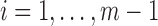
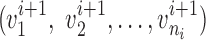
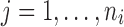
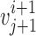
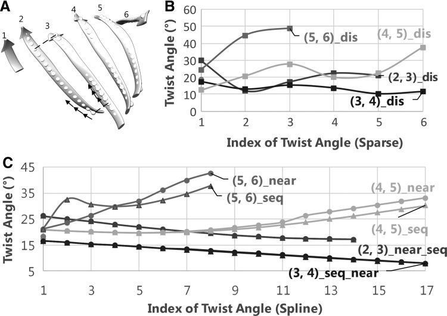
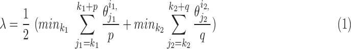
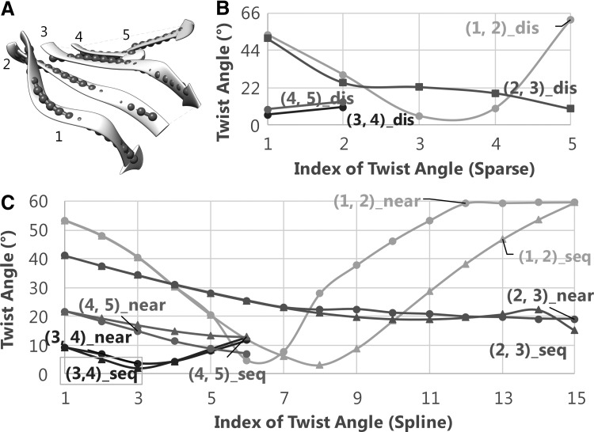
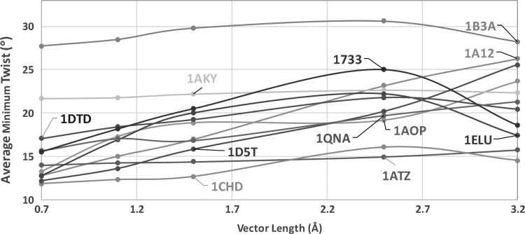

<section class="paper-abstract">
<h2>Abstract</h2>

<strong>Since the discovery of right-handed twist of a β-strand, many studies have been conducted to understand the twist. Given the atomic structure of a protein, twist angles have been defined using atomic positions of the backbone. However, limited study is available to characterize twist when the atomic positions are not available, but the central lines of β-strands are. Recent studies in cryoelectron microscopy show that it is possible to predict the central lines of β-strands from a medium-resolution density map. Accurate measurement of twist angles is important in identification of β-strands from such density maps. We propose an effective method to quantify twist angles from a set of splines. In a data set of 55 pairs of β-strands from 11 β-sheets of 11 proteins, the spline measurement shows comparable results as measured using the discrete method that uses atomic positions directly, particularly in capturing twist angle change along a pair, different levels of twist among different pairs, and the average of twist angles. The proposed method provides an alternative method to characterize twist using the central lines of a β-sheet.</strong>

</section>

<section id="s001"><h2>1. Introduction</h2>

A β-sheet is a major secondary structure of many proteins. Although modeling atomic structures of β-sheets is often a challenging task, recent studies show that it is possible to predict central lines of β-strands from a medium-resolution (5–10 Å) density map obtained by cryoelectron microscopy (cryo-EM) by analyzing their twist (Si and He <a href="#B14">2014</a>). The atomic position of the β-strands is not visible in the density maps at such resolutions. Existing measurements of twist were established on positions of β-strand atoms, and hence are not applicable to central lines of β-strands. An accurate method to measure twist of β-strands directly from central lines of β-strands is needed.

Secondary structure elements such as helices and β-sheets are the most striking structural features visible in medium-resolution density maps (three-dimensional (3D) images). Various computational methods have been developed to detect helices and β-sheets (Jiang et al., <a href="#B6">2001</a>; Kong et al., <a href="#B7">2004</a>; Dal Palu et al., <a href="#B4">2006</a>; Baker et al., <a href="#B1">2007</a>; Zeyun and Bajaj, <a href="#B17">2008</a>), including the recent methods <em>SSEhunter</em>, <em>SSELearner</em>, <em>VolTrac</em>, and <em>SSETracer</em> (Baker et al., <a href="#B1">2007</a>; Rusu and Wriggers, <a href="#B12">2012</a>; Si et al., <a href="#B16">2012</a>; Si and He, <a href="#B13">2013</a>). A helix detected from 3D image can be represented by its axis, and a β-sheet can be represented as a set of voxels at the β-sheet region. A few methods have been recently developed to generate candidates of central lines of β-strands from simple β-sheet images (Si and He, <a href="#B14">2014</a>) and β-barrel images (Si and He, <a href="#B15">2017</a>) that are segmented from the density map of an entire protein. An accurate measurement of β-strand twist is important to distinguish the correct set of central lines from candidate sets.

A β-sheet is composed of at least two β-strands that are stabilized by interstrand hydrogen bonds. The direction of each β-strand is the direction of protein sequence. Given the atomic positions of a protein structure, two procedures were previously defined to calculate the twist of β-strands. The former measured the twist of hydrogen bonding direction or peptide planes about the axis parallel to the β-strand (Chothia, <a href="#B2">1973</a>; Richardson, <a href="#B11">1981</a>). This measurement involves single strand demonstrating a right-handed twist of about 5° per amino acid on average (Chothia et al., <a href="#B3">1977</a>). The latter measured the angle formed by two vectors along two neighboring strands, respectively (Quiocho et al., <a href="#B10">1977</a>), and showed a left-handed twist about an axis perpendicular to the strand direction. In this article, we propose a method to measure twist using the central lines of β-strands. We compare twist angles measured using atomic positions and central lines, respectively, and show that the proposed method is sensitive enough to capture the nature of twist along a pair of central lines.
</section><section id="s002"><h2>2. Methodology</h2>
<section id="s003"><h3>2.1. Measurement of a twist angle from atomic positions of two neighboring β-strands</h3>

We measured twist angles directly from atomic positions of the backbone described previously (Ho and Curmi, <a href="#B5">2002</a>). Let <em>v1</em> be a vector formed by two consecutive midpoints on β-strand . A midpoint is the middle point of the peptide bond, the C–N bond, on the backbone. Let <em>v2</em> be a similar vector formed by consecutive midpoints of a neighboring β-strand , that is the closest vector to <em>v1</em> in . The twist angle is the acute angle formed by <em>v1</em> and <em>v2</em> (Ho and Curmi, <a href="#B5">2002</a>). Note that each angle involves three consecutive amino acids. Once the backbone of a protein is given, twist angles can be calculated for the hydrogen-bonded portion of a pair of β-strands (Murzin et al., <a href="#B8">1994</a>). We refer this measurement as the discrete (sparse) method in comparison with the method using splines (details in <a href="#s004">Section 2.2</a>).
</section><section id="s004"><h3>2.2. Measurement of twist angles from a pair of central lines of β-strands</h3>

When the 3D image of a β-sheet is available, central lines of β-strands can be derived from the image using computational methods such as StrandTwister (Si and He, <a href="#B14">2014</a>) and StrandRoller (Si and He, <a href="#B15">2017</a>). For the purpose of characterization of twist, a cubic spline generated from the midpoints used in the sparse method in <a href="#s003">Section 2.1</a> was used as a central line, instead of splines derived from the image of a β-sheet. Let , be the central lines of β-strands, and  and  are hydrogen bonded for . Without the knowledge of hydrogen bond locations, a pairing segment needs to be identified for each pair of neighboring strands (<a href="#f1">Fig. 1A</a>). This was done by taking each of the two ends of the splines and identifying the nearest point on the pairing spline. For simplicity, the shorter strand of the pair was used as the reference in dividing into equal-length vectors. We investigated two methods of selecting vectors of the same length in the pairing strand. Suppose that the pairing segment of the reference spline  is divided into <em>ni</em> vectors of a specific length . Let  be a tuple of vectors of the same length on the neighboring spline , and let twist  be the acute angle formed by  and  for . For nearest-vector measurement,  is the nearest vector of . For sequential-vector measurement, the beginning point of  is the ending point of . Note that nearest-vector measurement allows two consecutive vectors to overlap as long as the nearest-vector principle is maintained. We investigated vector length of 0.7, 1.1, 1.5, 2.5, and 3.2 Å.

<figure class="paper-fig" id="f1"><h4 class="obj_head"><strong>FIG. 1.</strong></h4>

<figcaption>
Twist angles calculated from atomic positions and central lines of β-strand in protein 1ATZ (PDB ID) sheet A. <strong>(A)</strong> The atomic structure of β-strands shown as ribbons is superimposed with the splines (dots) of the β-strands that are sampled with a 1.1 Å vector length. The pairing segment (marked with dashed lines) and vectors are marked (black arrows). <strong>(B)</strong> Twist angles measured using the discrete method. <strong>(C)</strong> Twist angles measured from splines. Those angles measured using nearest-vector and sequential-vector methods are marked with circles and triangles, respectively. Pair (1,2) is colored dark in <strong>(B, C)</strong>. PDB, Protein Data Bank.
</figcaption></figure></section><section id="s005"><h3>2.3. Averaged minimum twist</h3>

Both discrete and spline methods measure twist locally for individual β-strands. The level of twist is often different at different locations of the strand and for different β-strands. To characterize the level of twist for different β-sheets, we define in <a href="#eq24">Equation (1)</a> an average minimum twist (AMT), , for a set of splines. The idea of AMT is to characterize the region with the minimum twist for the two longest pairs of β-strands. In principle, all twist angles can be included in characterization, but we observed, in practice, that those angles at the edge of a β-sheet are often not as accurate as those at the central region if splines are derived from cryo-EM images rather than the atomic structure. If ( and  are the two longest pairs of splines, then the AMT  is defined in <a href="#eq24">Equation (1)</a>. <em>p</em> and <em>q</em> are parameters, for which we used 4 in this article.

<table class="disp-formula" id="disp-formula1"><tr><td class="formula"></td></tr></table></section></section><section id="s006"><h2>3. Results and Discussion</h2>

Eleven β-sheets, each from a different protein, were used in analysis of twist angles. The atomic structure of each protein was downloaded from Protein Data Bank (PDB). Twist angles were measured both sparsely (using the discrete method) and finely (using splines). The splines (<a href="#f1">Figs. 1A</a> and <a href="#f2">2A</a>) appear to align well with the ribbons that represent the central lines of β-strands in Chimera (Pettersen et al., <a href="#B9">2004</a>). Since the distance between two consecutive midpoints is about 3.3 Å, the number of twist angles measured from a pair of splines is three times of twist angles measured sparsely if 1.1 Å vector length is used for splines.

<figure class="paper-fig" id="f2"><h3 class="obj_head"><strong>FIG. 2.</strong></h3>

<figcaption>
Twist angles calculated from atomic positions and central lines of β-strands in protein 1AOP (PDB ID). See <a href="#f1">Figure 1</a> caption for more details in labels and legends.
</figcaption></figure><section id="s007"><h3>3.1. Twist angles measured using the discrete method and the spline method</h3>

The discrete measurement shows that the smallest twist angle is 10.21° that is the fifth angle of pair  (<a href="#f1">Fig. 1B</a>) formed by β-strand 3 and β-strand 4 (<a href="#f1">Fig. 1A</a>). The largest twist angle is 48.92°, the third angle of pair (, ) for 1ATZ sheet A (<a href="#f1">Fig. 1B</a>). A typical range of twist angles of proteins was previously reported (Ho and Curmi, <a href="#B5">2002</a>). Since twist angles are often different depending on where they are measured, we calculated an average of twist angles for each pair. The pair of β-strands that has the smallest overall twist angles and smallest variation is pair (), as seen from the average of 13.44° and standard deviation of 2.32° [row of 1ATZ_(3,4) with columns 4 and 5 in <a href="#T1">Table 1</a>]. The plot of twist angles shows that there is smaller twist along the pair formed by  and  (brown curve in <a href="#f1">Fig. 1B</a>) when they are compared with other pairs. However, there is much larger twist for pair (, ) (purple curve in <a href="#f1">Fig. 1B</a>), with an average of 39.38° (<a href="#T1">Table 1</a>). We observe a similar trend of overall twist among different pairs for both the discrete method and the spline method for the 1ATZ sheet A. For example, both methods rank overall amount of twist from the highest to the lowest as pairs (5,6), (4,5), (2,3), and (3,4) (<a href="#f1">Fig. 1B, C</a>). This order is also shown in the average of twist angles of 31.38°, 23.99°, 20.53°, and 12.16° for those pairs measured using the spline method and 39.38°, 23.45°, 20.55°, and 13.44° measured, respectively, using the discrete method (rows of 1ATZ in <a href="#T1">Table 1</a>). Although the two methods produce different twist angles, they produce the same result in distinguishing the overall level of twist among different pairs.

<section class="paper-table" id="T1"><h4 class="obj_head">
Table 1.</h4>

Average and Standard Deviation of Twist Angles Measured Using the Spline Method and the Discrete Method for Each Pair of β-Strands

<table frame="hsides" rules="groups">
<colgroup span="1">
<col align="left" span="1"/>
<col align="left" span="1"/>
<col align="left" span="1"/>
<col align="left" span="1"/>
<col align="left" span="1"/>
<col align="left" span="1"/>
<col align="left" span="1"/>
<col align="left" span="1"/>
<col align="left" span="1"/>
<col align="left" span="1"/>
</colgroup>
<thead><tr>
<th align="left" colspan="1" rowspan="1">
<em>Index</em><a href="#tf1">a</a>
</th>
<th align="center" colspan="1" rowspan="1">
<em>A_s</em><a href="#tf1">b</a>
</th>
<th align="center" colspan="1" rowspan="1">
<em>S_s</em><a href="#tf1">c</a>
</th>
<th align="center" colspan="1" rowspan="1">
<em>A_d</em><a href="#tf1">d</a>
</th>
<th align="center" colspan="1" rowspan="1">
<em>S_d</em><a href="#tf1">e</a>
</th>
<th align="center" colspan="1" rowspan="1">
<em>Index</em><a href="#tf1">a</a>
</th>
<th align="center" colspan="1" rowspan="1">
<em>A_s</em><a href="#tf1">b</a>
</th>
<th align="center" colspan="1" rowspan="1">
<em>S_s</em><a href="#tf1">c</a>
</th>
<th align="center" colspan="1" rowspan="1">
<em>A_d</em><a href="#tf1">d</a>
</th>
<th align="center" colspan="1" rowspan="1">
<em>S_d</em><a href="#tf1">e</a>
</th>
</tr></thead>
<tbody>
<tr>
<td align="left" colspan="1" rowspan="1">1B3A_(1,2)</td>
<td align="center" colspan="1" rowspan="1">25.85</td>
<td align="center" colspan="1" rowspan="1">6.65</td>
<td align="center" colspan="1" rowspan="1">21.64</td>
<td align="center" colspan="1" rowspan="1">6.85</td>
<td align="center" colspan="1" rowspan="1">1ELU_(5,6)</td>
<td align="center" colspan="1" rowspan="1">20.04</td>
<td align="center" colspan="1" rowspan="1">7.43</td>
<td align="center" colspan="1" rowspan="1">16.41</td>
<td align="center" colspan="1" rowspan="1">0.97</td>
</tr>
<tr>
<td align="left" colspan="1" rowspan="1">1B3A_(2,3)</td>
<td align="center" colspan="1" rowspan="1">38.14</td>
<td align="center" colspan="1" rowspan="1">1.86</td>
<td align="center" colspan="1" rowspan="1">35.35</td>
<td align="center" colspan="1" rowspan="1">3.74</td>
<td align="center" colspan="1" rowspan="1">1ELU_(6,7)</td>
<td align="center" colspan="1" rowspan="1">29.80</td>
<td align="center" colspan="1" rowspan="1">9.51</td>
<td align="center" colspan="1" rowspan="1">30.10</td>
<td align="center" colspan="1" rowspan="1">8.10</td>
</tr>
<tr>
<td align="left" colspan="1" rowspan="1">1A12_(1,2)</td>
<td align="center" colspan="1" rowspan="1">51.03</td>
<td align="center" colspan="1" rowspan="1">N/A</td>
<td align="center" colspan="1" rowspan="1">52.27</td>
<td align="center" colspan="1" rowspan="1">N/A</td>
<td align="center" colspan="1" rowspan="1">1D5T_(1,2)</td>
<td align="center" colspan="1" rowspan="1">38.28</td>
<td align="center" colspan="1" rowspan="1">3.53</td>
<td align="center" colspan="1" rowspan="1">39.00</td>
<td align="center" colspan="1" rowspan="1">6.37</td>
</tr>
<tr>
<td align="left" colspan="1" rowspan="1">1A12_(2,3)</td>
<td align="center" colspan="1" rowspan="1">24.71</td>
<td align="center" colspan="1" rowspan="1">6.97</td>
<td align="center" colspan="1" rowspan="1">24.19</td>
<td align="center" colspan="1" rowspan="1">7.68</td>
<td align="center" colspan="1" rowspan="1">1D5T_(2,3)</td>
<td align="center" colspan="1" rowspan="1">15.82</td>
<td align="center" colspan="1" rowspan="1">5.51</td>
<td align="center" colspan="1" rowspan="1">15.22</td>
<td align="center" colspan="1" rowspan="1">8.07</td>
</tr>
<tr>
<td align="left" colspan="1" rowspan="1">1A12_(3,4)</td>
<td align="center" colspan="1" rowspan="1">23.34</td>
<td align="center" colspan="1" rowspan="1">10.74</td>
<td align="center" colspan="1" rowspan="1">26.00</td>
<td align="center" colspan="1" rowspan="1">15.03</td>
<td align="center" colspan="1" rowspan="1">1D5T_(3,4)</td>
<td align="center" colspan="1" rowspan="1">8.43</td>
<td align="center" colspan="1" rowspan="1">0.93</td>
<td align="center" colspan="1" rowspan="1">10.39</td>
<td align="center" colspan="1" rowspan="1">6.12</td>
</tr>
<tr>
<td align="left" colspan="1" rowspan="1">1AKY_(1,2)</td>
<td align="center" colspan="1" rowspan="1">26.57</td>
<td align="center" colspan="1" rowspan="1">3.33</td>
<td align="center" colspan="1" rowspan="1">27.51</td>
<td align="center" colspan="1" rowspan="1">4.60</td>
<td align="center" colspan="1" rowspan="1">1D5T_(4,5)</td>
<td align="center" colspan="1" rowspan="1">17.65</td>
<td align="center" colspan="1" rowspan="1">2.63</td>
<td align="center" colspan="1" rowspan="1">18.08</td>
<td align="center" colspan="1" rowspan="1">2.57</td>
</tr>
<tr>
<td align="left" colspan="1" rowspan="1">1AKY_(2,3)</td>
<td align="center" colspan="1" rowspan="1">20.08</td>
<td align="center" colspan="1" rowspan="1">0.20</td>
<td align="center" colspan="1" rowspan="1">19.26</td>
<td align="center" colspan="1" rowspan="1">7.54</td>
<td align="center" colspan="1" rowspan="1">1D5T_(5,6)</td>
<td align="center" colspan="1" rowspan="1">16.01</td>
<td align="center" colspan="1" rowspan="1">0.72</td>
<td align="center" colspan="1" rowspan="1">18.37</td>
<td align="center" colspan="1" rowspan="1">9.17</td>
</tr>
<tr>
<td align="left" colspan="1" rowspan="1">1AKY_(3,4)</td>
<td align="center" colspan="1" rowspan="1">21.12</td>
<td align="center" colspan="1" rowspan="1">0.90</td>
<td align="center" colspan="1" rowspan="1">20.33</td>
<td align="center" colspan="1" rowspan="1">8.41</td>
<td align="center" colspan="1" rowspan="1">1D5T_(6,7)</td>
<td align="center" colspan="1" rowspan="1">23.04</td>
<td align="center" colspan="1" rowspan="1">10.15</td>
<td align="center" colspan="1" rowspan="1">25.77</td>
<td align="center" colspan="1" rowspan="1">14.14</td>
</tr>
<tr>
<td align="left" colspan="1" rowspan="1">1AKY_(4,5)</td>
<td align="center" colspan="1" rowspan="1">16.72</td>
<td align="center" colspan="1" rowspan="1">1.40</td>
<td align="center" colspan="1" rowspan="1">16.49</td>
<td align="center" colspan="1" rowspan="1">1.04</td>
<td align="center" colspan="1" rowspan="1">1DTD_(1,2)</td>
<td align="center" colspan="1" rowspan="1">20.37</td>
<td align="center" colspan="1" rowspan="1">5.51</td>
<td align="center" colspan="1" rowspan="1">19.92</td>
<td align="center" colspan="1" rowspan="1">3.88</td>
</tr>
<tr>
<td align="left" colspan="1" rowspan="1">1AOP_(1,2)</td>
<td align="center" colspan="1" rowspan="1">40.51</td>
<td align="center" colspan="1" rowspan="1">18.04</td>
<td align="center" colspan="1" rowspan="1">31.88</td>
<td align="center" colspan="1" rowspan="1">22.68</td>
<td align="center" colspan="1" rowspan="1">1DTD_(2,3)</td>
<td align="center" colspan="1" rowspan="1">22.41</td>
<td align="center" colspan="1" rowspan="1">13.51</td>
<td align="center" colspan="1" rowspan="1">21.14</td>
<td align="center" colspan="1" rowspan="1">4.50</td>
</tr>
<tr>
<td align="left" colspan="1" rowspan="1">1AOP_(2,3)</td>
<td align="center" colspan="1" rowspan="1">25.66</td>
<td align="center" colspan="1" rowspan="1">6.94</td>
<td align="center" colspan="1" rowspan="1">25.25</td>
<td align="center" colspan="1" rowspan="1">13.81</td>
<td align="center" colspan="1" rowspan="1">1DTD_(3,4)</td>
<td align="center" colspan="1" rowspan="1">12.11</td>
<td align="center" colspan="1" rowspan="1">6.71</td>
<td align="center" colspan="1" rowspan="1">11.10</td>
<td align="center" colspan="1" rowspan="1">6.29</td>
</tr>
<tr>
<td align="left" colspan="1" rowspan="1">1AOP_(3,4)</td>
<td align="center" colspan="1" rowspan="1">7.29</td>
<td align="center" colspan="1" rowspan="1">2.76</td>
<td align="center" colspan="1" rowspan="1">8.26</td>
<td align="center" colspan="1" rowspan="1">2.29</td>
<td align="center" colspan="1" rowspan="1">1DTD_(4,5)</td>
<td align="center" colspan="1" rowspan="1">15.76</td>
<td align="center" colspan="1" rowspan="1">4.92</td>
<td align="center" colspan="1" rowspan="1">9.38</td>
<td align="center" colspan="1" rowspan="1">1.67</td>
</tr>
<tr>
<td align="left" colspan="1" rowspan="1">1AOP_(4,5)</td>
<td align="center" colspan="1" rowspan="1">13.67</td>
<td align="center" colspan="1" rowspan="1">5.16</td>
<td align="center" colspan="1" rowspan="1">9.13</td>
<td align="center" colspan="1" rowspan="1">N/A</td>
<td align="center" colspan="1" rowspan="1">1DTD_(5,6)</td>
<td align="center" colspan="1" rowspan="1">15.94</td>
<td align="center" colspan="1" rowspan="1">2.69</td>
<td align="center" colspan="1" rowspan="1">15.80</td>
<td align="center" colspan="1" rowspan="1">3.03</td>
</tr>
<tr>
<td align="left" colspan="1" rowspan="1">1ATZ_(1,2)</td>
<td align="center" colspan="1" rowspan="1">18.42</td>
<td align="center" colspan="1" rowspan="1">N/A</td>
<td align="center" colspan="1" rowspan="1">18.54</td>
<td align="center" colspan="1" rowspan="1">N/A</td>
<td align="center" colspan="1" rowspan="1">1DTD_(6,7)</td>
<td align="center" colspan="1" rowspan="1">16.20</td>
<td align="center" colspan="1" rowspan="1">4.62</td>
<td align="center" colspan="1" rowspan="1">24.07</td>
<td align="center" colspan="1" rowspan="1">13.26</td>
</tr>
<tr>
<td align="left" colspan="1" rowspan="1">1ATZ_(2,3)</td>
<td align="center" colspan="1" rowspan="1">20.53</td>
<td align="center" colspan="1" rowspan="1">3.00</td>
<td align="center" colspan="1" rowspan="1">20.55</td>
<td align="center" colspan="1" rowspan="1">5.86</td>
<td align="center" colspan="1" rowspan="1">1DTD_(7,8)</td>
<td align="center" colspan="1" rowspan="1">35.09</td>
<td align="center" colspan="1" rowspan="1">3.73</td>
<td align="center" colspan="1" rowspan="1">38.36</td>
<td align="center" colspan="1" rowspan="1">7.56</td>
</tr>
<tr>
<td align="left" colspan="1" rowspan="1">1ATZ_(3,4)</td>
<td align="center" colspan="1" rowspan="1">12.16</td>
<td align="center" colspan="1" rowspan="1">2.60</td>
<td align="center" colspan="1" rowspan="1">13.44</td>
<td align="center" colspan="1" rowspan="1">2.32</td>
<td align="center" colspan="1" rowspan="1">1QNA_(1,2)</td>
<td align="center" colspan="1" rowspan="1">24.73</td>
<td align="center" colspan="1" rowspan="1">N/A</td>
<td align="center" colspan="1" rowspan="1">25.50</td>
<td align="center" colspan="1" rowspan="1">N/A</td>
</tr>
<tr>
<td align="left" colspan="1" rowspan="1">1ATZ_(4,5)</td>
<td align="center" colspan="1" rowspan="1">23.99</td>
<td align="center" colspan="1" rowspan="1">4.56</td>
<td align="center" colspan="1" rowspan="1">23.45</td>
<td align="center" colspan="1" rowspan="1">7.78</td>
<td align="center" colspan="1" rowspan="1">1QNA_(2,3)</td>
<td align="center" colspan="1" rowspan="1">26.01</td>
<td align="center" colspan="1" rowspan="1">1.99</td>
<td align="center" colspan="1" rowspan="1">28.00</td>
<td align="center" colspan="1" rowspan="1">3.28</td>
</tr>
<tr>
<td align="left" colspan="1" rowspan="1">1ATZ_(5,6)</td>
<td align="center" colspan="1" rowspan="1">31.38</td>
<td align="center" colspan="1" rowspan="1">7.23</td>
<td align="center" colspan="1" rowspan="1">39.38</td>
<td align="center" colspan="1" rowspan="1">10.65</td>
<td align="center" colspan="1" rowspan="1">1QNA_(3,4)</td>
<td align="center" colspan="1" rowspan="1">14.33</td>
<td align="center" colspan="1" rowspan="1">1.46</td>
<td align="center" colspan="1" rowspan="1">16.33</td>
<td align="center" colspan="1" rowspan="1">8.86</td>
</tr>
<tr>
<td align="left" colspan="1" rowspan="1">1CHD_(1,2)</td>
<td align="center" colspan="1" rowspan="1">39.97</td>
<td align="center" colspan="1" rowspan="1">7.10</td>
<td align="center" colspan="1" rowspan="1">43.32</td>
<td align="center" colspan="1" rowspan="1">11.34</td>
<td align="center" colspan="1" rowspan="1">1QNA_(4,5)</td>
<td align="center" colspan="1" rowspan="1">18.00</td>
<td align="center" colspan="1" rowspan="1">1.55</td>
<td align="center" colspan="1" rowspan="1">22.51</td>
<td align="center" colspan="1" rowspan="1">13.95</td>
</tr>
<tr>
<td align="left" colspan="1" rowspan="1">1CHD_(2,3)</td>
<td align="center" colspan="1" rowspan="1">15.44</td>
<td align="center" colspan="1" rowspan="1">2.07</td>
<td align="center" colspan="1" rowspan="1">13.27</td>
<td align="center" colspan="1" rowspan="1">1.95</td>
<td align="center" colspan="1" rowspan="1">1QNA_(5,6)</td>
<td align="center" colspan="1" rowspan="1">25.80</td>
<td align="center" colspan="1" rowspan="1">5.30</td>
<td align="center" colspan="1" rowspan="1">24.34</td>
<td align="center" colspan="1" rowspan="1">18.15</td>
</tr>
<tr>
<td align="left" colspan="1" rowspan="1">1CHD_(3,4)</td>
<td align="center" colspan="1" rowspan="1">15.95</td>
<td align="center" colspan="1" rowspan="1">1.66</td>
<td align="center" colspan="1" rowspan="1">16.26</td>
<td align="center" colspan="1" rowspan="1">1.95</td>
<td align="center" colspan="1" rowspan="1">1QNA_(6,7)</td>
<td align="center" colspan="1" rowspan="1">17.42</td>
<td align="center" colspan="1" rowspan="1">1.12</td>
<td align="center" colspan="1" rowspan="1">12.93</td>
<td align="center" colspan="1" rowspan="1">4.76</td>
</tr>
<tr>
<td align="left" colspan="1" rowspan="1">1CHD_(4,5)</td>
<td align="center" colspan="1" rowspan="1">15.83</td>
<td align="center" colspan="1" rowspan="1">4.54</td>
<td align="center" colspan="1" rowspan="1">15.31</td>
<td align="center" colspan="1" rowspan="1">6.05</td>
<td align="center" colspan="1" rowspan="1">1QNA_(7,8)</td>
<td align="center" colspan="1" rowspan="1">16.75</td>
<td align="center" colspan="1" rowspan="1">0.16</td>
<td align="center" colspan="1" rowspan="1">19.06</td>
<td align="center" colspan="1" rowspan="1">9.73</td>
</tr>
<tr>
<td align="left" colspan="1" rowspan="1">1CHD_(5,6)</td>
<td align="center" colspan="1" rowspan="1">17.13</td>
<td align="center" colspan="1" rowspan="1">6.83</td>
<td align="center" colspan="1" rowspan="1">16.69</td>
<td align="center" colspan="1" rowspan="1">5.47</td>
<td align="center" colspan="1" rowspan="1">1QNA_(8,9)</td>
<td align="center" colspan="1" rowspan="1">22.75</td>
<td align="center" colspan="1" rowspan="1">0.86</td>
<td align="center" colspan="1" rowspan="1">24.00</td>
<td align="center" colspan="1" rowspan="1">2.89</td>
</tr>
<tr>
<td align="left" colspan="1" rowspan="1">1CHD_(6,7)</td>
<td align="center" colspan="1" rowspan="1">36.28</td>
<td align="center" colspan="1" rowspan="1">17.89</td>
<td align="center" colspan="1" rowspan="1">30.90</td>
<td align="center" colspan="1" rowspan="1">16.66</td>
<td align="center" colspan="1" rowspan="1">1733_(1,2)</td>
<td align="center" colspan="1" rowspan="1">20.26</td>
<td align="center" colspan="1" rowspan="1">6.60</td>
<td align="center" colspan="1" rowspan="1">15.71</td>
<td align="center" colspan="1" rowspan="1">6.17</td>
</tr>
<tr>
<td align="left" colspan="1" rowspan="1">1ELU_(1,2)</td>
<td align="center" colspan="1" rowspan="1">29.82</td>
<td align="center" colspan="1" rowspan="1">6.27</td>
<td align="center" colspan="1" rowspan="1">26.56</td>
<td align="center" colspan="1" rowspan="1">11.31</td>
<td align="center" colspan="1" rowspan="1">1733_(2,3)</td>
<td align="center" colspan="1" rowspan="1">13.77</td>
<td align="center" colspan="1" rowspan="1">4.36</td>
<td align="center" colspan="1" rowspan="1">14.77</td>
<td align="center" colspan="1" rowspan="1">4.88</td>
</tr>
<tr>
<td align="left" colspan="1" rowspan="1">1ELU_(2,3)</td>
<td align="center" colspan="1" rowspan="1">10.43</td>
<td align="center" colspan="1" rowspan="1">3.77</td>
<td align="center" colspan="1" rowspan="1">9.71</td>
<td align="center" colspan="1" rowspan="1">4.42</td>
<td align="center" colspan="1" rowspan="1">1733_(3,4)</td>
<td align="center" colspan="1" rowspan="1">16.69</td>
<td align="center" colspan="1" rowspan="1">5.97</td>
<td align="center" colspan="1" rowspan="1">18.76</td>
<td align="center" colspan="1" rowspan="1">0.44</td>
</tr>
<tr>
<td align="left" colspan="1" rowspan="1">1ELU_(3,4)</td>
<td align="center" colspan="1" rowspan="1">20.61</td>
<td align="center" colspan="1" rowspan="1">0.71</td>
<td align="center" colspan="1" rowspan="1">14.40</td>
<td align="center" colspan="1" rowspan="1">2.18</td>
<td align="center" colspan="1" rowspan="1">1733_(4,5)</td>
<td align="center" colspan="1" rowspan="1">33.93</td>
<td align="center" colspan="1" rowspan="1">10.53</td>
<td align="center" colspan="1" rowspan="1">34.12</td>
<td align="center" colspan="1" rowspan="1">12.58</td>
</tr>
<tr>
<td align="left" colspan="1" rowspan="1">1ELU_(4,5)</td>
<td align="center" colspan="1" rowspan="1">23.95</td>
<td align="center" colspan="1" rowspan="1">3.78</td>
<td align="center" colspan="1" rowspan="1">24.84</td>
<td align="center" colspan="1" rowspan="1">4.49</td>
<td align="center" colspan="1" rowspan="1">Avg_all<a href="#tf1">f</a>
</td>
<td align="center" colspan="1" rowspan="1">22.25</td>
<td align="left" colspan="1" rowspan="1"> </td>
<td align="center" colspan="1" rowspan="1">22.06</td>
<td align="left" colspan="1" rowspan="1"> </td>
</tr>
</tbody>
</table>

a
The PDB ID and the pair ID; bthe average and cstandard deviation of twist angles of the pair measured using the spline method with nearest vectors; dthe average and estandard deviation of twist angles measured by the discrete method; fAvg_all: the average of 55 pairs of average twist angles in the column.

N/A, not available when the number of data points is &lt;3; PDB, Protein Data Bank.

</section>
The change among twist angles along a pair is shown similarly from both the spline and the discrete measurements. As an example, twist angles of pair (2,3) of 1AOP are monotonically decreasing shown from the discrete measurement (red curve in <a href="#f2">Fig. 2B</a>). They are also monotonically decreasing in the spline measurement if the nearest vector was used (red curve in <a href="#f2">Fig. 2C</a>). The twist curve appears as a well for pair (1,2) of 1AOP in both measurements (cyan curves in <a href="#f2">Fig. 2B, C</a>). Although the overall nature of twist change along a pair can be reflected from both methods, the spline measurement shows smoother transition than the discrete measurement, as expected from more sampling using splines. We observed this property from both 1ATZ, 1AOP, and the rest of the nine β-sheets in the test (data not shown). The comparison of twist angles using the two methods is summarized in <a href="#T1">Table 1</a>. We observed that the average twist angles among 55 pairs of β-strands are comparable between the two methods (Column 2 vs. Column 4 and Column 7 vs. Column 9 of <a href="#T1">Table 1</a>). The average twist angles of all 55 pairs are 22.25° for discrete measurement, very close to 22.06° for the spline measurement.
</section><section id="s008"><h3>3.2. Measurement using nearest vectors and sequential vectors</h3>

Unlike discrete measurement in which vectors are defined by atomic positions of the backbone, twist measurement using splines needs to have well-defined vectors. We investigated two ways to define vectors. The nearest-vector method emphasizes local twist angles more than the sequential method. Although similar twist angles are produced by the two definitions of vectors for most of the angles in the test, different values are observed. For example, the second angle of pair  is 23.4° using the nearest vectors, but it is 32.5° using sequential vector for 1ATZ (<a href="#f1">Fig. 1C</a>). Given that the vector length is only 1.1 Å in this case, it is not expected to have a large twist change for the backbone in such a small distance. More “jumps” of twist angles were observed in the use of sequential vectors than the use of nearest vectors. We show that using nearest vectors produces more robust measurement of twist angles.
</section><section id="s009"><h3>3.3. Vector length</h3>

Twist angles are generally different when measured with different vector lengths. We sampled vector length of 0.7, 1.1, 1.5, 2.5, and 3.2 Å for the data set of 11 proteins. To examine the overall effect of twist for the comparable regions among the 11 β-sheets, we monitored the AMT that is the average of twist angles nearby the minimum twist regions of two longest pairs for a β-sheet. We observe that AMT stays similar when different vector lengths are used for some β-sheets (1ATZ, 1AKY, and 1B3A). However, it is quite different for some other β-sheets (1D5T, 1A12, and 1QNA), and thus further investigation is needed. The nature of twist produced by different pairs is different. We observed that most pairs show increasing or decreasing twist angles along the pair, but some pairs show odd fluctuations. Those β-sheets that show less stable AMT between 0.7 and 1.5 Å vector length tend to have “unusual” pairs, such as 1AOP (<a href="#f2">Figs. 2</a> and <a href="#f3">3</a>). It appears that AMT is more stable for vector length &lt;1.5 Å for most of the cases. The twist angles shown in <a href="#f1">Figures 1</a>, <a href="#f2">2</a>, and <a href="#T1">Table 1</a> were calculated using 1.1 Å that is about one-third of the distance between two consecutive midpoints of the backbone. It is notable that the average twist angles for the spline method are also comparable with those generated by the discrete methods when 1.1 Å was used as the vector length (<a href="#T1">Table 1</a>).

<figure class="paper-fig" id="f3"><h4 class="obj_head"><strong>FIG. 3.</strong></h4>

<figcaption>
Effect of vector length shown as the averaged minimum twist for 11 β-sheets. Nearest vectors were used in the measurement.
</figcaption></figure></section></section><section id="s010"><h2>4. Conclusion</h2>

Twist of β-strands has been analyzed extensively in the literature. However, most studies are based on the discrete measurement directly using atomic positions of the protein backbones. We propose a new method to measure twist angles using a pair of splines of β-strands. In this method, a pairing segment is first determined and the angles are measured using the nearest-vector method with a 1.1 Å vector length. In a data set of 55 pairs of β-strands from 11 β-sheets of 11 proteins, the spline measurement shows comparable results as measured using the discrete method, particularly in terms of capturing twist angle change along a pair, overall amount of twist among different pairs, and the average of twist angles. The proposed method provides an alternative method to characterize twist angles at different regions of the β-sheet. It can be used to characterize twist when the atomic structure is not available but the central lines of β-strands are available, a situation in analysis of 3D image data at medium resolutions obtained from cryo-EM.
</section><section id="s011"><h2>Acknowledgments</h2>

The work in this article was supported, in part, by NSF DBI-1356621, NIH R01-GM062968, Modeling and Simulation Scholarship (to T.I.), and Honors College Undergraduate Research Scholarship (to M.P.) of Old Dominion University.
</section><section id="s012"><h2>Authors' Contributions</h2>

All authors participated in the design of the method. T.I. implemented the method and conducted the test. M.P. assisted the organization of data and results. J.H. wrote the article.
</section><section id="s013"><h2>Author Disclosure Statement</h2>

No competing financial interests exist.
</section><section id="ref-list1"><h2>References</h2>
<section id="ref-list1_sec2"><ol>
<li id="B1">
<cite>Baker M.L., Ju T., and Chiu W.
2007. 
Identification of secondary structure elements in intermediate-resolution density maps. Structure
15:7–19</cite> [<a href="https://doi.org/10.1016/j.str.2006.11.008">doi</a>]</li>
<li id="B2">
<cite>Chothia C.
1973. 
Conformation of twisted beta-pleated sheets in proteins. J Mol Biol
75:295–302</cite> [<a href="https://doi.org/10.1016/0022-2836(73)90022-3">doi</a>]</li>
<li id="B3">
<cite>Chothia C., Levitt M., and Richardson D.
1977. 
Structure of proteins: Packing of alpha-helices and pleated sheets. Proc Natl Acad Sci U S A
74:4130–4134</cite> [<a href="https://doi.org/10.1073/pnas.74.10.4130">doi</a>]</li>
<li id="B4">
<cite>Palu Dal A., He J., Pontelli E., et al. 
2006. 
Identification of alpha-helices from low resolution protein density maps. Proc Comput Syst Bioinformatics Conf (CSB)
89–98</cite></li>
<li id="B5">
<cite>Ho B.K., and Curmi P.M.
2002. 
Twist and shear in beta-sheets and beta-ribbons. J Mol Biol
317:291–308</cite> [<a href="https://doi.org/10.1006/jmbi.2001.5385">doi</a>]</li>
<li id="B6">
<cite>Jiang W., Baker M.L., Ludtke S.J., et al. 
2001. 
Bridging the information gap: Computational tools for intermediate resolution structure interpretation. J Mol Biol
308:1033–1044</cite> [<a href="https://doi.org/10.1006/jmbi.2001.4633">doi</a>]</li>
<li id="B7">
<cite>Kong Y., Zhang X., Baker T.S., et al. 
2004. 
A Structural-informatics approach for tracing beta-sheets: Building pseudo-C(alpha) traces for beta-strands in intermediate-resolution density maps. J Mol Biol
339:117–130</cite> [<a href="https://doi.org/10.1016/j.jmb.2004.03.038">doi</a>]</li>
<li id="B8">
<cite>Murzin A.G., Lesk A.M., and Chothia C.
1994. 
Principles determining the structure of beta-sheet barrels in proteins. I. A theoretical analysis. J Mol Biol
236:1369–1381</cite> [<a href="https://doi.org/10.1016/0022-2836(94)90064-7">doi</a>]</li>
<li id="B9">
<cite>Pettersen E.F., Goddard T.D., Huang C.C., et al. 
2004. 
UCSF Chimera—A visualization system for exploratory research and analysis. J Comput Chem
25:1605–1612</cite> [<a href="https://doi.org/10.1002/jcc.20084">doi</a>]</li>
<li id="B10">
<cite>Quiocho F.A., Gilliland G.L., and Phillips G.N., Jr.
1977. 
The 2.8-A resolution structure of the L-arabinose-binding protein from <em>Escherichia coli</em>. Polypeptide chain folding, domain similarity, and probable location of sugar-binding site. J Biol Chem
252:5142–5149</cite></li>
<li id="B11">
<cite>Richardson J.S.
1981. 
The anatomy and taxonomy of protein structure. Adv Protein Chem
34:167–339</cite> [<a href="https://doi.org/10.1016/s0065-3233(08)60520-3">doi</a>]</li>
<li id="B12">
<cite>Rusu M., and Wriggers W.
2012. 
Evolutionary bidirectional expansion for the tracing of alpha helices in cryo-electron microscopy reconstructions. J Struct Biol
177:410–419</cite> [<a href="https://doi.org/10.1016/j.jsb.2011.11.029">doi</a>]</li>
<li id="B13">
<cite>Si D., and He J.
2013. 
Beta-sheet detection and representation from medium resolution cryo-EM density maps. BCB’13: Proc ACM Conf Bioinform Comput Biol Biomed Inform
764–770</cite></li>
<li id="B14">
<cite>Si D., and He J.
2014. 
Tracing beta-strands using strandtwister from cryo-EM density maps at medium resolutions. Structure
22:1665–1676</cite> [<a href="https://doi.org/10.1016/j.str.2014.08.017">doi</a>]</li>
<li id="B15">
<cite>Si D., and He J.
2017. 
Modeling beta-traces for beta-barrels from cryo-EM density maps. Biomed Res Int
2017:9</cite> [<a href="https://doi.org/10.1155/2017/1793213">doi</a>]</li>
<li id="B16">
<cite>Si D., Ji S., Al Nasr K., et al. 
2012. 
A machine learning approach for the identification of protein secondary structure elements from electron cryo-microscopy density maps. Biopolymers
97:698–708</cite> [<a href="https://doi.org/10.1002/bip.22063">doi</a>]</li>
<li id="B17">
<cite>Zeyun Y., and Bajaj C.
2008. 
Computational approaches for automatic structural analysis of large biomolecular complexes. IEEE/ACM Trans Comput Biol Bioinform
5:568–582</cite> [<a href="https://doi.org/10.1109/TCBB.2007.70226">doi</a>]</li>
</ol></section></section>
